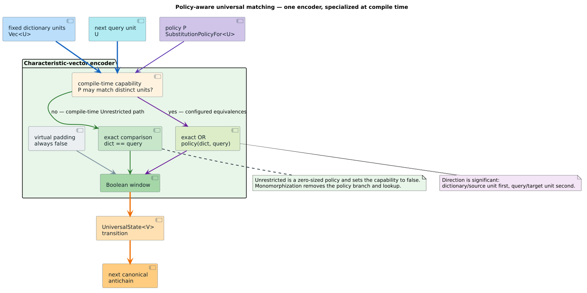

# Universal policy-aware characteristic-vector encoding

**Date:** 2026-09-02  
**Status:** Accepted after semantic, differential, property, and pinned-core performance validation  
**Scope:** `UniversalAutomaton`, `UniversalOnlineAutomaton`, and `CharacteristicVector`

## Question

Does `UniversalAutomaton::with_policy` preserve and apply its configured
zero-cost substitution relation for byte, Unicode-scalar, and other
`CharUnit` sequences without adding work to the default Standard Levenshtein
path?

Before this experiment, the constructor discarded its policy value and every
universal characteristic vector used exact scalar equality. The type parameter
therefore advertised semantics that execution did not provide.

## Definitions and direction

A dictionary unit is the source of a substitution and a query unit is its
target. For dictionary window unit $`d_i`$, streamed query unit $`q`$, and
policy relation $`P`$, the policy-aware characteristic bit is:

```math
b_i = (d_i = q) \lor P(d_i, q).
```

The relation can be asymmetric. If a set contains `é → e`, the dictionary word
`café` may match the query `cafe` at zero substitution cost; the reverse match
does not follow unless `e → é` is also present. Virtual prefix padding is not a
dictionary unit and always contributes `false`, even under a policy that accepts
every concrete pair.

The policy relation extends the exact characteristic vector from
[Mitankin's universal-automata theory](../research/universal-levenshtein/README.md);
it does not change the universal state transition alphabet, which remains a
Boolean vector.



## Hypotheses

1. Retaining `P` in the automaton and applying it while constructing each
   characteristic vector makes configured substitutions observable in all
   universal position variants.
2. Parameterizing the online machine over `U: CharUnit` supports bytes,
   Unicode scalars, `u64` tokens, and external unit types through one encoder.
3. Branching on the associated constant
   `P::MAY_MATCH_DISTINCT_UNITS` outside the window loop preserves the exact
   path for `Unrestricted`, whose constant is `false` and whose value is a
   zero-sized type.
4. A real Unicode policy lookup has measurable cost, but that cost occurs only
   for policy types that can match distinct units.

## Implementation

The accepted design stores the policy rather than `PhantomData<P>` and gives
the online machine a defaulted unit parameter:

```rust
pub struct UniversalOnlineAutomaton<
    V: PositionVariant,
    P: SubstitutionPolicy = Unrestricted,
    U: CharUnit = char,
>;
```

The public surfaces are:

| Domain | Batch | Stable online machine | Policy bound |
|---|---|---|---|
| Unicode scalar | `accepts(&str, &str)` | `online(&str)` | `SubstitutionPolicyFor<char>` |
| Raw byte | `accepts_bytes(&[u8], &[u8])` | `online_bytes(&[u8])` | `SubstitutionPolicyFor<u8>` |
| Generic unit | `accepts_units(&[U], &[U])` | `online_units(&[U])` | `SubstitutionPolicyFor<U>` |

`CharacteristicVector::from_units_with_policy` exposes the same unit-generic
encoding for custom execution and diagnostics. `Restricted` and
`OwnedRestricted` cover borrowed and owned byte configuration;
`RestrictedChar` and the new `OwnedRestrictedChar` provide the corresponding
Unicode ownership choices.

The unrestricted path executes only exact comparisons. The policy-aware path
executes the same comparisons and consults the policy only for distinct units.
Both paths preallocate the exact Boolean-window capacity. `online(&str)` moves
its collected `Vec<char>` into the online state, avoiding a second allocation
or clone.

## Semantic evidence

| Evidence | Result |
|---|---|
| One-way byte equivalence, including raw `0xff → 0xfe` | Forward accepted; reverse rejected |
| One-way Unicode equivalence `é → e` | Forward accepted; reverse and unrelated pairs rejected |
| Standard, Transposition, Merge-and-Split | All consume the shared policy-aware vector |
| Policy equivalence plus ordinary insertion/deletion | Composition agrees with the configured budget |
| Borrowed and `Arc`-owned policies | Both remain valid through batch and online execution |
| Custom `SubstitutionPolicyFor<u64>` | Uses the same generic encoder and preserves direction |
| Padding under an allow-everything policy | Padding remains false; concrete window units match |
| Exact-only policy whose lookup panics | Lookup is never called when its capability is false |
| Random byte and Unicode sequences | Universal Standard acceptance equals a directional dynamic-programming oracle |
| Singleton dictionary differential tests | Universal and parameterized Standard, Transposition, and Merge-and-Split agree |

The targeted semantic suite passed 61 automaton tests. The existing and new
singleton differential suite passed four tests. Property cases use budgets
from zero through three and deliberately do not assume symmetry.

## Performance protocol

- Hardware: AMD Ryzen Threadripper PRO 5975WX, 32 physical cores, one thread per
  core.
- Compiler: `rustc 1.95.0`, LLVM 22.1.2, optimized benchmark profile.
- Benchmark: registered Criterion target `policy_zero_cost`, group
  `universal_policy_encoding`.
- Workload: 39 Unicode scalars, distance two, full `accepts` execution.
- Isolation: CPU 6 affinity via `taskset`; the two-second preflight measured CPU
  6 at 98.49% idle. Other work was concentrated on CPUs 16–23 and therefore did
  not share a physical core.
- Sampling: three-second warm-up, ten-second measurement, 100 samples per case.
- Recorded artifacts during the run: topology/frequency snapshot, per-core
  utilization, compiler identity, and complete Criterion output.

## Performance results

| Case | 95% interval | Throughput interval | Relative midpoint |
|---|---:|---:|---:|
| Default `new(2)` / exact input | 1.6196–1.6228 µs | 24.032–24.080 Melem/s | baseline |
| Explicit `with_policy(2, Unrestricted)` / exact input | 1.6037–1.6064 µs | 24.277–24.319 Melem/s | 0.99% faster |
| `RestrictedChar` / one equivalence hit | 1.8074–1.8162 µs | 21.473–21.578 Melem/s | 11.78% slower |

The default and explicit unrestricted constructors produce the same concrete
`UniversalAutomaton<Standard, Unrestricted>` type and use the same
monomorphized transition method. The explicit form was marginally faster in
this sequential run, so there is no evidence of policy-storage or policy-call
overhead in the unrestricted path. The exact-only panic test independently
proves that the lookup path is bypassed. The measured 11.78% Unicode-policy
cost is the expected work of checking distinct window units against the
configured set, not a default-path regression.

## Conclusion

All four hypotheses were supported. Policy application belongs in
characteristic-vector construction because that is the last layer at which
both dictionary and query units are present. One generic encoder now governs
all universal variants and supported unit domains; the default exact path
remains specialized through a compile-time capability and zero-sized policy.

The foreign-binding completeness matrix continues to classify universal
automata as `audit-required`. This record proves the Rust semantics that those
facades must expose; it does not misclassify absent foreign APIs as complete.

