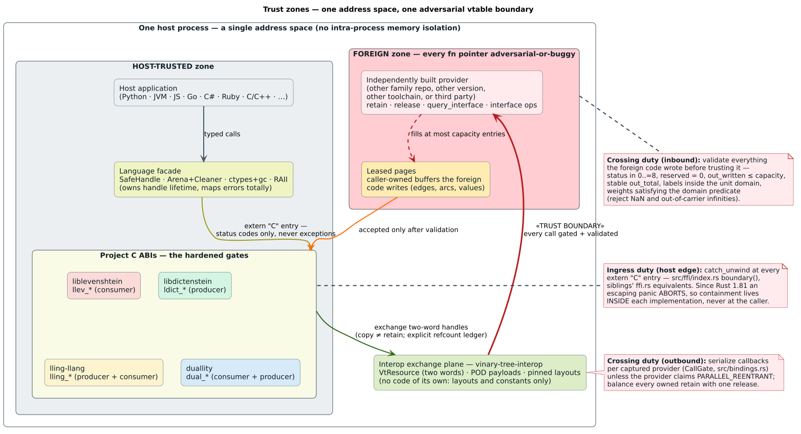

# Binding trust model — liblevenshtein as a resource consumer

The family-wide trust model — zones, the containment law, threading by
claim, validation duties, exhaustion vectors, WASI policy, and non-goals —
is specified once in the
[interop security model](https://github.com/vinary-tree/vinary-tree-interop/blob/master/docs/security-model.md);
this document **instantiates it for liblevenshtein's own surfaces** and
cites it rather than restating it. The project-wide threat model for
non-binding surfaces (serialization, `.llre` parsing, resource ceilings)
remains [docs/SECURITY.md](../SECURITY.md); this page covers what is
specific to consuming foreign dictionary resources and exporting the
`llev_*` C ABI.

liblevenshtein's position in the zone map: its `llev_*` entry points are
**trusted code receiving hostile inputs** (from the host application), and
its resource consumer receives **untrusted callback outputs** (from
whatever stands behind a `VtResource`) — a buggy sibling, a version-skewed
sibling, or an adversary; the same validation defends against all three.

---

## 1. Containment at the `llev_*` gate

Every fallible `llev_*` entry point executes inside `boundary()`
(`src/ffi/index.rs:124-148`): `catch_unwind` around the whole operation, a
caught panic downcast to its message and surfaced as `LLEV_STATUS_PANIC`,
success clearing the per-thread error slot, failure storing the message.
Nothing unwinds across the ABI in either direction — the family law
([canon § 3](https://github.com/vinary-tree/vinary-tree-interop/blob/master/docs/security-model.md#3-the-panic-and-exception-containment-law)),
contract row `ffi-boundary-panic-containment` in
[`UNSAFE_ABI_CONTRACTS.tsv`](../verification/UNSAFE_ABI_CONTRACTS.tsv).

The symmetric duty: callers' `extern "C"` callbacks (the batch reducer)
must not unwind into the library — a reducer signals failure through its
return status, which `llev_query_cursor_reduce` forwards verbatim
([C-ABI reference § 7.6](../bindings/c-abi-reference.md#76-llev_query_cursor_reduce)).

## 2. The error channel is bounded and library-owned

`LAST_ERROR` (`src/ffi/index.rs`) is thread-local, library-owned, and
NUL-sanitized; `llev_last_error_message` hands out a borrowed pointer the
caller never frees. Capacity discipline: **one message per thread**, plus
**one latched `BindingError` per provider** on the fault channel
(`src/bindings.rs:121`, first fault wins) — constant space per thread and
per provider by construction, however chatty a hostile provider gets
(canon § 6, "message-channel flooding"). Contract row
`ffi-last-error-thread-locality`.

## 3. The status wire: decode, never transmute

**Landed hardening (this wave).** Interop callbacks return their status as
a **raw `u32`** on the Rust side; the consumer decodes at the single
`status()` chokepoint via `VtStatus::from_raw`, and an out-of-range value
becomes `BindingError::InvalidProviderOutput` — provider misbehavior, never
undefined behavior. This closed the highest-severity consumer finding,
[LLEV-B6](../bindings/FINDINGS_LEDGER.md) (commit `e42485c`, family-wide;
the round-trip bijection over 0..=8 is pinned in
`vinary-tree-interop/tests/discriminant_pins.rs`). The C header is
byte-identical — C enums are integer-typed; only Rust needed the rule.
Contract row `ffi-callback-status-trust` states the decode-before-use duty.

The analogous *project-level* wire — a reducer callback's `LlevStatus`
return — carries the documented duty that the callback return one of the
13 published values; the abort channel forwards it verbatim.

## 4. Leases: why stale batches cannot dangle

The C ABI's batch views are borrowed pointers into cursor-owned arenas —
exactly the shape use-after-free exploits love. The lease machine removes
every path to a dangling read *by refusal*, not by caller discipline:

- **Free-under-lease is refused, not deferred**: `llev_query_cursor_free`
  on a leased cursor returns `LLEV_STATUS_BATCH_IN_USE` and the cursor —
  and therefore every borrowed pointer — stays alive and caller-owned.
  Freeing storage the caller still borrows is the use-after-free factory
  this rule exists to shut (contract row `ffi-handle-box-round-trip`).
- **Advance-under-lease is refused**: `next_batch`/`reduce` return
  `BATCH_IN_USE` while a lease is live, so the library never overwrites
  arenas a caller is reading (`ffi-leased-batch-aliasing`: no mutation, no
  reallocation during the borrow window; the two-pass pointer fixup makes
  realloc-dangling structurally impossible —
  [resource-consumer § 7](../bindings/resource-consumer.md#7-cursor-anatomy-batches-arenas-and-the-two-pass-fixup)).
- **Generations are unforgeable in practice**: strictly increasing per
  cursor, never zero, and release demands the **exact** live generation —
  a stale, replayed, or zero generation is `INVALID_ARGUMENT` and changes
  nothing. A confused caller cannot "accidentally" release a newer lease
  with an older token and then read freed memory.
- Formal home: `LlevBatchLease.tla` (LLEV-LEASE-1..7, this wave), with the
  Verus arena obligations (LLEV-ARENA-1..3) covering the fixup window;
  anchor tests in
  [`tests/ffi_resource_snapshot_semantics.rs`](../../tests/ffi_resource_snapshot_semantics.rs).

## 5. Validation duties, instantiated

The canon's duty table
([§ 5](https://github.com/vinary-tree/vinary-tree-interop/blob/master/docs/security-model.md#5-input-validation-duties))
lands in this consumer as follows — the full mechanism-by-mechanism
walkthrough is [resource-consumer.md](../bindings/resource-consumer.md):

| Hostile input | This consumer's response | State |
|---|---|---|
| Out-of-range status code | refused at the decode chokepoint (§ 3) | **landed** (LLEV-B6 fixed) |
| Malformed negotiation output (null vtable on success, short `struct_size`, wrong `abi_version`, nonzero base `reserved`) | `IncompatibleResourceAbi` / `InvalidProviderOutput` at intake; the fresh retain is released on every rejection path | landed (W1 baseline) |
| Snapshot that is null or changes unit/value domain | `InvalidProviderOutput`; a revision cannot change what its labels mean | landed |
| Out-of-domain edge label | rejected, never truncated (truncation aliases labels) | landed |
| Non-boolean flag bytes (`is_final`, `found`, `has_value` outside zero/one) | `InvalidProviderOutput` | landed |
| Page-length lies (`written > capacity`, shrinking totals, no-progress pages) | rejected by the paging acceptance checks; the three family consumers' predicates are being **harmonized to the single proven `ConsumerAcceptance.v` predicate this wave** — [LLEV-B8 / F3](../bindings/FINDINGS_LEDGER.md) | wave-W3 hardening |
| Nonzero `VtOptionalU64.reserved` | validated as zero from this wave — [LLEV-B7 / F2](../bindings/FINDINGS_LEDGER.md), aligning with lling-llang's existing arc-reserved check under VT-ABI-5 | wave-W3 hardening |
| `End` from an interface callback | treated as a provider error (family pin F5) | landed |

**Residual exhaustion note (documented current state).** The canon's
inflated-`out_total` vector prescribes never sizing allocations from a
provider-claimed total. The consumer pages through fixed 256-entry buffers
as prescribed, but its edge expansion *does* pre-reserve its result vector
from the claimed remaining total once pages validate; a fabricated total
therefore upgrades from wasted paging into an allocation fault — a caught
`capacity overflow` panic (surfacing as `PANIC`) or, in a magnitude band
below `isize::MAX`, an allocator abort. Memory safety is not at stake;
availability is. This is flagged alongside the wave-W3 paging-acceptance
harmonization (the acceptance predicate is where a claimed-total sanity
bound belongs) rather than silently absorbed into it.

## 6. Threading and the gate, from the attacker's chair

Serialization is per captured provider object (VT-GATE-1..3;
[resource-consumer § 4](../bindings/resource-consumer.md#4-the-call-gate)).
The security-relevant corollaries:

- a provider that **lies about `PARALLEL_REENTRANT`** races only its own
  state; whatever garbage the races produce re-enters through § 5's
  validation (canon § 4 carries the full argument);
- a provider panic that poisons the gate mutex does **not** wedge later
  callers — both the call path and the drop path recover the lock;
- a provider that **blocks forever** holds its calling thread (and any
  queued thread) hostage: in-process there is no preemption to offer.
  Bounding that requires out-of-process or sandboxed deployment — a
  non-goal of the ABI, by design (canon § 8).

## 7. Sandboxed deployments

The WASI capability policy (preopens only; persistent backends only at
preopened paths in `wasi`-feature builds; trap containment at the instance
boundary) is canon § 7, instantiated for this repo's shared JavaScript runtime in
[wasm-topology § 5-6](../bindings/wasm-topology.md#5-wasi-capability-policy)
— including the two open, this-wave hardening items on that surface:
panic-class sites in the runtime crate
([LLEV-B4](../bindings/FINDINGS_LEDGER.md)) and the N-API
declared-but-unbound symbols ([LLEV-B12](../bindings/FINDINGS_LEDGER.md)).

## 8. What this consumer does **not** claim

Everything in canon § 8 applies verbatim — no in-process memory-safety
guarantee against a *hostile* native provider (RustBelt scopes what safe
Rust can promise: the consumer adds no unsafety of its own, per the
contract rows in
[`UNSAFE_ABI_CONTRACTS.tsv`](../verification/UNSAFE_ABI_CONTRACTS.tsv);
it cannot police its neighbor's stores), no confidentiality inside the
process, no liveness against a stalled callback, isolation only by
deployment choice. The one llev-specific addition: the distance functions
and string helpers are pure and stateless, so their entire threat surface
is argument validation (sentinel-coded, [C-ABI reference § 6](../bindings/c-abi-reference.md#6-distance-functions-24)).

---

*Canonical upstream:*
[family security model](https://github.com/vinary-tree/vinary-tree-interop/blob/master/docs/security-model.md) ·
[project threat model](../SECURITY.md) ·
[UNSAFE_ABI_CONTRACTS.tsv](../verification/UNSAFE_ABI_CONTRACTS.tsv) ·
[findings ledger](../bindings/FINDINGS_LEDGER.md). *Siblings:*
[libdictenstein FFI boundary](https://github.com/vinary-tree/libdictenstein/blob/master/docs/security/ffi-boundary.md) ·
[lling-llang ABI trust model](https://github.com/vinary-tree/lling-llang/blob/master/docs/security/abi-trust-model.md) ·
[duallity threat model](https://github.com/vinary-tree/duallity/blob/master/docs/security/threat-model.md).
