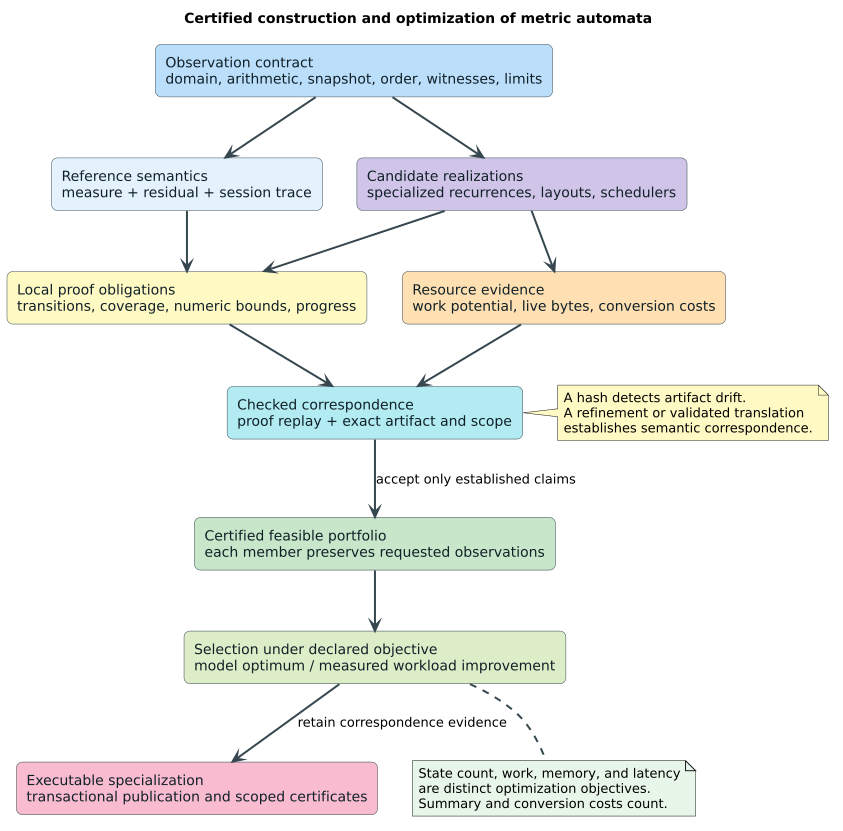

# Certified execution and optimization of metric automata

**Status:** theory extension and CBC design contract; generic proof kernels
are mechanized, production adoption is separately identified.
**Companions:** [Ordered Residual Calculus](ordered-residual-calculus.md) (ORC)
and [lazy ordered-cost product automata](lazy-ordered-cost-product-automata.md)
(LOCPA).

A **correct-by-construction (CBC)** automaton is obtained through constructions
whose evidence establishes its requested observations. This requires a
connection between the specification, each accepted transformation, and the
executable artifact. A correct recurrence, a reviewed marker trait, or a
proof about an analogous model supplies part of that connection.

This extension specifies execution observations and the certificates needed
to preserve them; strengthens ordered kNN pruning with cost-conditioned tie
information; and gives separate meanings to optimization of results, pruning,
representations, and execution resources.

## 1. What the review changes

| Existing result | Additional obligation or stronger result |
|---|---|
| R2 preserves outputs after each input | Execution must account for invalidity, witnesses, incomplete outcomes, and divergence |
| R2a permits any finite switching schedule | Internal optimization steps need a progress argument; infinitely many conversions can prevent completion |
| BF-1 uses a global subtree tie floor | BF-2 needs a tie floor only among candidates that can attain the cost bound |
| Admissible scalar cost bounds combine by maximum | Conditioned rank bounds combine as whole lexicographic pairs; their coordinates cannot be mixed freely |
| A finite residual quotient is state-minimal | State count supplies neither minimum memory bytes nor fastest execution |
| A transformation preserves completed answers | Its changed resource trace and page behavior require their own contract |
| A certificate describes a mathematical machine | Acceptance must bind domain, arithmetic, observation, scope, and executable correspondence |

“Highly optimized” means choosing among certified alternatives under an
explicit resource objective and workload. A stronger abstract bound can reduce
exact verification while increasing total work. A smaller state machine can
require more expensive transitions. These tradeoffs belong in the model.

## 2. Observation profiles and lawful executions

Fix a contract
$`\Gamma=(D,q,\theta,\mathcal N,\sigma,\tau,\prec,\mathcal W,\mathcal B)`$:

- $`D`$ is the validated input domain, including any quotient identity;
- $`q,\theta`$ are the query and immutable scoring parameters;
- $`\mathcal N`$ fixes arithmetic, primitive order, rounding, and overflow;
- $`\sigma`$ is the captured dictionary revision, where a dictionary is used;
- $`\tau`$ is the inclusive semantic cutoff;
- $`\prec`$ specifies result identity, ordering, and ties;
- $`\mathcal W`$ specifies witness observations; and
- $`\mathcal B`$ specifies work, storage, and paging limits and their units.

The distance cutoff, cumulative resource ceilings, and a per-call page budget
are different quantities. Changing one does not authorize changing the others.

An **observation profile** selects what a client can distinguish.

| Profile | Required observation |
|---|---|
| Online score | Validity and exact or cutoff-tagged score after every committed prefix |
| Completed range | Exactly the declared candidates, scores, identities, and promised order |
| Completed kNN | The first $`\min(k,|U|)`$ exact ranked candidates in the finite eligible universe $`U`$ |
| Witness | The specified witness or canonical optimum, including tie decisions |
| Resumable operation | Snapshot, committed progress, reason tag, and a continuation denoting all remaining work |
| Resource safety | Charges, reservations, live storage, and peak bounds in declared units |

A kNN contract must define eligibility, including structural nonmatches and
numeric failures. The expression above assumes each member of $`U`$ has an
eligible exact rank; failures are represented separately. For $`k=0`$,
the empty result follows only after the contract's required validation.
Error precedence is part of the API when observable.

Write a step as $`s\xrightarrow{\alpha,w}s'`$, where $`\alpha`$ is a finite
list of observable events and $`w`$ records resource use. Empty $`\alpha`$
denotes internal work, such as a cache probe or a representation conversion.
An observation projection may erase internal events; it must not erase
invalidity, overflow, completion tags, or required witness distinctions.
A change of result schedule needs a profile allowing that schedule, or an
explicit relation between traces. Erasing events alone does not justify
permuting ordered outputs.

Cache hit and miss paths may compute the same semantic successor while
pausing at different positions under a fixed work limit. Thus LOCPA CC-1
certifies the pure successor; it does not assert equality of resource traces
or partial pages.

## 3. Construction certificates and their composition

### 3.1 The certificate package

A checked artifact binds evidence to one specification and realization.
The observation profile determines which obligations apply.

| Evidence | Proposition it establishes |
|---|---|
| Domain | Accepted inputs satisfy $`D`$; invalid inputs follow the declared rejection behavior |
| Realization | Seed, transitions, and final observations satisfy R2 |
| Abstraction | Every represented original is covered and each bound is admissible in $`\mathcal N`$ |
| Reduction | Normalization, interning, and caches preserve observations under complete scope keys |
| Execution | Concrete transitions simulate reference transitions and preserve the session invariant |
| Progress | Internal work terminates or returns a permitted incomplete outcome; completion has no missing work |
| Resources | Executed work and retained allocations satisfy the ledger and storage model |
| Geometry | The untruncated measure has the requested metric or quotient laws on $`D`$ |
| Artifact correspondence | The executable realizes the model to which these propositions refer |

A certificate contains checked proof terms or a successful check by a validator
whose soundness has been established. A Boolean, source hash, or sealed marker
alone does not prove a semantic proposition. Hashes locate artifacts; canonical
payload equality and the declared integrity mechanism bind their identity.
Source changes invalidate correspondence evidence unless a new certificate
explicitly covers them.

An implementation can use a proved generator with a proved lowering, or
validate each generated implementation separately. Its trust boundary names
the proof checker, primitive arithmetic model, extraction or translation path,
and runtime assumptions. Monomorphized recurrences, SIMD operations, and
specialized storage are compatible with CBC when their correspondence is
covered. This follows the established separation of proof production and
checking in [proof-carrying code](https://people.eecs.berkeley.edu/~necula/Papers/pcc_fmcs97.pdf).

### 3.2 CBC-1: local certificates compose into execution preservation

Let $`I`$ be an implementation, $`S`$ a reference system, and $`R`$ relate
their states. Require related initial states. For every related pair and
implementation step, require

```math
R(i,s)\land i\xrightarrow{\alpha}_I i'
\Longrightarrow
\exists s'.\ s\xRightarrow{\alpha}_S s'\land R(i',s').
```

Here $`\xRightarrow{\alpha}`$ is a finite sequence of reference steps whose
event lists concatenate to $`\alpha`$. An internal implementation step may
correspond to zero reference steps. Require separately that a concrete
completed state relates to a reference completed state with the same selected
result observation.

**Theorem CBC-1.** These obligations imply that every finite implementation
execution has a reference execution with the same projected trace and related
final states. Completed observations therefore satisfy the reference contract.
Two such refinements compose by relational composition.

**Proof.** The empty execution uses the initial relation. For a nonempty
execution, the local certificate supplies a matching reference fragment and
the relation at its end. Apply induction to the remaining execution and
concatenate the reference fragments. For composition, lift the second local
certificate over the entire intermediate fragment using the same induction.
The intermediate related state witnesses relational composition. Finally
apply the completed-state obligation.

[CompCert's small-step framework](https://compcert.org/doc/html/compcert.common.Smallstep.html)
provides a primary example of trace-based simulation methodology.
[CertifiedMetricExecution.v](../verification/temporal_automata/theories/CertifiedMetricExecution.v)
mechanizes the finite execution and composition argument here. Instantiating
the reference with the Rust library remains a separate proof.

### 3.2a A checked exact-integer certificate kernel

[CertifiedContracts.v](../verification/temporal_automata/theories/CertifiedContracts.v)
gives a small executable checker for expressions built from natural-valued
variables, constants, addition, and minimum. A certificate contains a sequence
of named rewrites and the source and target expression at each step. The
checker recomputes every rewrite target, checks adjacency between steps, and
checks equality of the supplied contract scope, including a conservative
exact cutoff match. It accepts only the explicit `ExactNaturals` arithmetic
profile and `ScoreOnly` observation profile; rounded arithmetic, ordered
results, and canonical-witness claims require different checkers. Its theorem proves that an
accepted exact certificate preserves expression value for *every* variable
environment and therefore every finite list of score observations. A distinct
lower-certificate type proves only that its result does not exceed the exact
expression. The file checks stale-snapshot,
changed-query, changed-parameter, changed-arithmetic, changed-observation,
missing-step, wrong-rule, broken-chain, fabricated-target, and valid-lower
examples. An integer
measure specification names the source expression; acceptance proves the
named target expression implements that measure in every environment.

This is a complete checker **for that expression language**. Its scope fields
are opaque tokens: the caller still has to bind them to the actual query,
parameters, arithmetic, snapshot, and observation profile. The language does
not encode the whole ORC realization IR, overflow, Rust control flow,
dictionary ownership, witnesses, or resources. Its acceptance theorem is
therefore one local certificate obligation, not executable CBC for the
library.

For the first concrete source connection, use a direct refinement of a named
standard integer Levenshtein transition path: the dispatch in
`src/transducer/variants/standard.rs` delegates to
`transition_standard_into` in `src/transducer/transition.rs`. The proof must relate the source
transition fields, checked integer arithmetic, final observation, and any
dictionary traversal it claims to the corresponding formal state. A small
verified transition is an intermediate instance; a whole-operation CBC claim
also requires the session and finalization proofs. This route minimizes
translation machinery while exposing the source-language and toolchain trust
boundary. Source hashes detect drift after the proof but cannot establish the
relation themselves.

### 3.2b Typed operation contracts

[CBCContractInterpretation.v](../verification/temporal_automata/theories/CBCContractInterpretation.v)
defines profile-indexed request and payload types for online scores,
completed range, completed kNN, canonical witnesses, resumable operations,
and resource observations. Its `measure_specification` fixes a validated
domain, quotient identity, parameters, numerical authority, reference
measure, and ordered valid-cost carrier. Its `operation_contract` fixes a
validated query, snapshot and distinct original identities, eligibility,
separate range and kNN tie orders, inclusive range cutoff, requested $`k`$,
budgets, and a nonempty set of selected profiles. The online request is a
target input; the witness request is an original occurrence; search and
resource requests use the fixed query and captured snapshot. Invalid-query
validation and error precedence occur before this valid-query contract is
constructed and remain source-instance obligations.

`ideal_range_law` covers exactly the eligible originals within the inclusive
cutoff in declared range order. `ideal_knn_law` covers all eligible originals
in cost-and-tie order independently of that cutoff. A completed kNN result
must equal the first $`k`$ of this independent order even when a range query
would fail. Online observations must correspond one-for-one with a declared,
nonempty attempted-prefix sequence; each prefix event must match its domain
check or exact/above-cutoff reference cost. Only the final attempt may fail or
stop incomplete, and either outcome leaves the preceding prefix committed.
An incomplete range or kNN
partial may contain only distinct, correctly ordered rows from its ideal
universe. It cannot claim exhaustion or final top-$`k`$ status.

A completed witness has a feasible path at the reference cost, no cheaper
feasible path, and no earlier equal-cost witness under the declared tie rule;
`Completed None` requires the original to be ineligible for the cutoff. A
completed session has no private or remaining work and no continuation. A
visible incomplete session partitions the captured originals, keeps published
and excluded originals sound with respect to an explicit range/kNN session
goal, and either
denotes its private/remaining work by a continuation or satisfies an explicit
terminal-incomplete predicate. Resource observations carry primitive events
and reported counters; the contract requires an event-accounting relation,
budget safety, and monotone cumulative charges and peaks. The concrete
meaning, units, and disjointness of charged and reserved work remain instance
premises.

`lawful_reference` requires the ideal-list laws and every selected
`observation_law`. `exact_realization` requires that lawful reference plus
equality for each selected profile. A generic theorem transfers the relevant
observation law to any exact realization. `lower_simulation`,
`metric_geometry`, and `resource_refinement` remain distinct propositions.
The file checks an inhabited one-original example where zero is a sound lower
bound for exact cost one but cannot be an exact realization; it also rejects a
foreign completed kNN row, omitted online prefix, unsound completed exclusion,
and unjustified partial row. The numerical descriptor, tie keys, prefix
sequence, request-specific failure and incomplete entitlement, witness
relation, continuation
denotation, and event accounting must be proved for each concrete operation.
The full checker, session refinement, and Rust correspondence are later gates.

### 3.2c Scoped finite rewrite replay

[CertificateChecking.v](../verification/temporal_automata/theories/CertificateChecking.v)
extends the exact-natural expression fragment with a typed, finite rewrite
certificate. Each step records a named rule, source and target expressions,
forward or backward orientation, the exact required-premise list, arithmetic
profile, witness effect, and a scope containing the query, parameters, domain,
cutoff, snapshot, dictionary revision, and label context. The checker compares
every step scope with the requested scope, then recomputes the rule result and
its premise list. It cannot accept an unknown rule identifier or a lower rule
in the reverse direction. The only admitted witness effect is the score-only
effect; a later witness-capable rule needs its own soundness theorem.

`replay_step_identifies_exact_rule_and_premises` establishes that an accepted
step names a supported rule, supplies precisely its required premises, and
matches that rule's computed result. `replay_steps_iff_finite_replay` relates
the executable checker to a finite inductive replay relation.
`accepted_scoped_certificate_sound` proves that accepted exact chains preserve
every natural-valued score, while accepted lower chains remain lower bounds.
The generic rejection theorems cover unknown rules, wrong premise lists,
reversed lower rules, and rounded-arithmetic steps; concrete controls also
reject revision changes, unsupported witness effects, and lower certificates
offered as exact equivalence. Premise names are audit labels: the checker
derives their actual validity from the finite rule definitions and their
kernel-checked soundness lemmas, rather than trusting a supplied name.
The scope fields are opaque tokens. Exact token comparison does not establish
that a token names the executable's actual query, parameters, dictionary
revision, or label interpretation; that binding is an instance obligation.

This checks the declared expression fragment only. It does not replay all
nodes of the ORC realization IR, prove floating-point rewrites, establish
witness preservation, or connect the certificate to Rust execution. Those
require additional checked rules and instance/correspondence proofs.

### 3.3 CBC-2: progress is a separate obligation

A machine that silently switches dense to sparse and back forever can satisfy
the finite-trace condition. Correct finite outputs do not imply that an output
is eventually produced.

Assign a natural rank $`r(i)`$ to consecutive internal steps that match no
reference work, and require strict decrease on each such step. If there are
$`n`$ internal steps from $`i`$ to $`i'`$, then

```math
n+r(i')\le r(i).
```

**Proof.** The zero-step case is equality. Each further step reduces the rank
by at least one; adding that inequality to the induction hypothesis proves
the result. The Rocq file checks this argument.

If every reference execution for a finite request has finitely many steps,
every other concrete step matches positive reference progress, no active
state is stuck, and the internal rank condition holds between progress
steps, the concrete request terminates or reaches an allowed suspension.
Otherwise an infinite execution would have either infinitely many reference
steps or an infinite internal segment, contradicting a premise. Client
resumption and external allocation availability are environment conditions;
no theorem forces a client to resume.

For adaptive layout choice, hysteresis can reduce switching but does not
replace this rank or an equivalent termination proof.

## 4. A session invariant that covers the whole search

Represent a session by $`(\Gamma,P,V,X,E,A,C,H,L,K)`$:

- $`P`$: pending product occurrences and their remaining candidate regions;
- $`V`$: ghost history of authoritative verifications, including candidates
  subsequently displaced from a best-$`k`$ heap;
- $`X`$: discarded candidates with sound exclusion evidence;
- $`E`$: retained exact range results or the selected best-$`k`$ heap;
- $`A,C`$: state arena and complete transition/summary caches;
- $`H`$: private work in progress, including phase and resumable cursors;
- $`L`$: the resource ledger; and
- $`K`$: ownership and reconstruction context for dictionary paths.

A **product occurrence** includes enough path context to identify its concrete
originals. Different occurrences may share a dictionary node or automaton
state. Sharing a representation does not identify their result identities.

The ownership discipline depends on the publication phase. An uncommitted
node split may borrow its parent region while that region remains in $`P`$;
publishing the complete split transfers its originals atomically to child
regions, terminal work, or sound exclusions. Once a candidate cursor advances
past an original, that original instead belongs to exclusive private work
$`H_o`$ until verification, exclusion, or result publication. These two kinds
of private work cannot be counted twice. Suspension may retain $`H_o`$;
terminal failure or cancellation may discard the unfinished session only
under an `Incomplete` outcome. A `Complete` outcome must exhaust all owned
work.

The bounded range implementation demonstrates why exclusive private ownership
is necessary: it increments a frame or scan cursor before applying the exact
candidate decision, and an accepted result may wait in `pending_match` across
a result-page pause. The cursor no longer covers that original while the
continuation still owns it. The [range continuation](../../src/time_series/elastic/walker.rs)
also keeps `results` and `pending_match` separate; a cancelled partial result
is a subset and need not include the latter.

| Bounded range source phase | Ownership effect | Remaining correspondence proof |
|---|---|---|
| Read bucket/slot and check the page work limit | Original stays in the pending cursor region | Prove no cursor increment on the budget-pause branch |
| Increment `next_candidate` or scan `slot` before lower-bound/exact scoring | Transfer one original to ephemeral private scoring | Prove each bucket member is enumerated once, including collisions |
| Reject by an admissible lower bound or exact `AboveCutoff`/`NoFiniteAlignment` | Transfer private original to sound exclusion | Bind the Rust bound and exact decision to the requested numeric contract |
| Store a verified result in `pending_match` on result-page exhaustion | Retain exclusive private ownership across resumption | Show the next `advance` publishes this match before reading a new candidate |
| Append a verified result to `results` | Transfer private ownership to retained results | Prove identity, exact cost, and capacity/charge observations |
| Finish or cancel | Sort completed results or return an exact partial subset | Prove the score/encounter tie order and keep `Incomplete` distinct from exhaustive completion |

The [finite cursor model report](../verification/CBC_RANGE_CURSOR_MODEL_REPORT.md)
checks this ownership lifecycle with separate original identities at a shared
node. Its omitted-private, skipped-collision, and early-pending-finish mutants
each violate the intended property. Its conditional fairness result addresses
only that bounded lifecycle.

For the simplest ownership discipline, maintain a disjoint cover

```math
U=E_o\uplus X\uplus H_o\uplus\biguplus_{Q\in P}U_Q.
```

Here $`E_o`$ is the set of original identities retained in $`E`$, $`X`$
contains soundly excluded originals (including verified candidates displaced
from a full best-$`k`$ heap), $`H_o`$ contains originals exclusively owned by
private work, and $`U_Q`$ is the unresolved region owned by pending occurrence
$`Q`$. The ghost verification history $`V`$ may overlap $`E_o`$ and $`X`$;
it is not another ownership class. The implementation can retain only its
compact best-$`k`$ heap and needed continuation state; ghost history is not
charged as live storage.
A backend with overlapping regions must instead prove an ownership or
deduplication invariant with equivalent coverage and multiplicity.
Set-union coverage alone cannot rule out duplicate emission.

[CertifiedRegionPartition.v](../verification/temporal_automata/theories/CertifiedRegionPartition.v)
provides a complete finite checker for an **explicit** parent list and a
terminal-plus-children split package. Acceptance is equivalent to a
permutation of original occurrences, so it preserves coverage and
multiplicity in any surrounding ownership context. The theorem is generic in
the decidable original identity; a checked path-and-bucket-slot instance
keeps two occurrences distinct even when they share a physical node. The checked controls
reject a missing terminal, a skipped collision member at a shared physical
node, a duplicate original, and a foreign original. The checker does not
derive the parent list from a captured dictionary or prove the Rust edge
iterator enumerates the submitted child lists. It materializes and scans
original lists, so it is a proof/reference checker rather than a proposed
hot-path production check; a compact structural certificate needs its own
source and resource proof.

[CertifiedStructuralSplit.v](../verification/temporal_automata/theories/CertifiedStructuralSplit.v)
constructs the explicit split from a total classifier over a supplied parent
list. It proves a permutation of all supplied originals, unique child labels,
and checker acceptance. Given a duplicate-free parent list, the result is
also duplicate-free. The constructor's classifier and parent enumeration are
still abstract inputs; the proof does not identify them with a captured Rust
dictionary snapshot. Its list buckets are a proof/reference representation,
not a proposal to scan complete subtrees during production search.

[CertifiedSearchSession.v](../verification/temporal_automata/theories/CertifiedSearchSession.v)
checks the exclusive-private fragment in which each **original occurrence** moves from
pending to private ownership, then atomically to verified or excluded. It
proves a disjoint list permutation, exclusion preservation, no duplicates,
and equality of winner **membership** after filtering the verified list when
both pending and private lists are empty. The model does not prove ordered
ranking of that set. A cursor-shaped specialization adds `Scoring` and
`AwaitingResult` phases, proves revision and ownership preservation across
pick, reject, accept, publish, and logical pause steps, and proves exact range
membership after cursor exhaustion when exact classification is supplied.
Its result list is reverse encounter history for membership proofs, not the
public range order. It does not prove the borrowed-parent split phase,
the exact Rust `pending_match`/cursor correspondence, the correctness of a concrete exclusion bound, ranked heap ordering,
snapshot/resource observations, or Rust correspondence. Those are separate
whole-session obligations.

| Action | Preconditions | Invariant-preserving effect |
|---|---|---|
| Split a region | Complete child and terminal enumeration on $`\sigma`$ | Partition unresolved originals among children and terminal verification work |
| Advance a candidate cursor | Cursor points to an unconsumed original | Move that original from $`P`$ to $`H_o`$ before scoring |
| Verify an original | Original payload and exact verifier agree with $`\Gamma`$ | Add its rank to ghost $`V`$; retain ownership in $`H_o`$ until it enters $`E_o`$ or soundly excluded $`X`$ |
| Pause on a result-page limit | Exact candidate already verified but no result slot available | Keep it in `pending_match` and $`H_o`$; do not advance the cursor again |
| Prune a region | A bound excludes every owned original for the current threshold | Move ownership to $`X`$ with that evidence |
| Tighten kNN threshold | Retain the best $`k`$ distinct verified ranks | Earlier discarded regions stay excluded as the kth rank decreases |
| Resolve a summary | Every relevant child and live terminal is covered | Publish a complete scope-bound certificate |
| Suspend | All committed fields satisfy the invariant | Retain private phase, remaining ownership, ledger, and snapshot |
| Complete | All unresolved work is exhausted or soundly excluded | Materialize the contract's exact ordered result |

A verified kNN candidate is provisional until no unresolved rank can precede
it. Streaming it as an irrevocable ranked result requires that additional
certificate. Range operations with dictionary order need their own emission
invariant.

The publication boundary covers arena IDs, cache entries, pending cursors,
and witnesses together. Private work may accumulate charges while the public
predecessor stays unchanged. An allocation failure after charged work must
retain or explicitly account for that work; rolling back semantic state does
not erase resource use. A cached resource failure cannot replace a semantic
dead transition.

Coverage is also a **cut condition** on the recurrence dependency graph.
Every unexamined accepting derivation must cross a represented live dependency.
For multi-label operations, a single DP row may not form such a cut: an edge
can jump over it. Include all retained generations and pending operations
needed for that proof. This connects ORC S1's dependency model to product
pruning instead of assuming a current-row minimum is always sufficient.

## 5. Numerical certificates that authorize machine pruning

Fix the exact authority: a mathematical real measure, an exact rational or
integer measure, or a particular binary64 expression graph. These can have
different observable answers.

Machine pruning requires $`\widehat L_{\mathcal N}\le d_{\mathcal N}`$ under
the public comparator. A real inequality $`L\le d`$ is insufficient on its
own. Cutoff equality uses exact comparison without an epsilon. Overflow,
invalid input, structural impossibility, and above-cutoff results retain the
profile's distinct tags. Reassociation, fused multiply-add, vector reductions,
and flush-to-zero modes need correspondence evidence when they change the
graph. Underflow can erase a mathematically positive cost, so domain
validation does not prove separation for rounded scores. Signed-zero
canonicalization must agree with the declared observations and comparator.

**NC-1 — enclosure-based geometric lower bound.** Suppose an exact metric
$`d`$ has certified enclosures
$`\ell(q,p)\le d(q,p)`$ and $`d(x,p)\le u(x,p)`$. Then

```math
\max(0,\ell(q,p)-u(x,p))\le d(q,x).
```

**Proof.** The triangle inequality gives
$`d(q,p)-d(x,p)\le d(q,x)`$. Replacing the first term by a lower bound and
the subtracted term by an upper bound can only decrease the left side.
Nonnegativity permits its maximum with zero. Downward-rounded subtraction
and maximum retain the inequality if their enclosure semantics are proved.

This licenses real-distance rejection. Comparing against a machine score
also needs its relation to the real score. If, for example,
$`d_{\mathcal N}(q,x)\ge d(q,x)-\epsilon(q,x)`$, subtract that certified
error allowance from the real lower bound with downward rounding.
Error estimates only on pivot distances do not cover rounding in the exact
candidate verifier. A nonnegative machine score also permits clipping the
resulting bound at zero.

Primitive enclosure certificates compose through monotone expression nodes
by induction on the evaluation DAG. Each node needs its own directed-rounding
or error theorem, including valid intermediate ranges. NC-1 is proved here
mathematically; a concrete binary64 enclosure implementation is an additional
artifact.

## 6. Stronger ordered pruning with scoped rank certificates

### 6.1 BF-2: the equality slice is enough

Use the exact rank $`R(x)=(d(q,x),t_\sigma(x))`$ and total lexicographic
order of LOCPA BF-1. A **rank certificate** for region $`Q`$ is a pair
$`(L,M)`$ satisfying

```math
\forall x\in U_Q,\qquad (L,M)\le_{\rm lex}R(x).
```

Given cost admissibility $`L\le d(q,x)`$ for every member, this certificate
is equivalent to the weaker secondary premise

```math
d(q,x)=L\Longrightarrow M\le t_\sigma(x).
```

**Proof.** When $`L<d(q,x)`$, lexicographic order holds regardless of the
tie coordinate. When the costs are equal, it is precisely the displayed
tie inequality. These are all cases under cost admissibility. Rocq checks
this characterization for natural ranks; the argument uses only a total
cost order.

A global tie floor satisfies this condition but may be weaker. To derive a
better floor without knowing exact scores, take a certified superset
$`S_Q(c)`$ of originals whose exact cost is at most $`c`$. For example,
with per-original lower bounds $`b(x)\le d(q,x)`$, use

```math
S_Q(c)=\{x\in U_Q:b(x)\le c\}.
```

Every exact at-or-below-cutoff original belongs to this set, since
$`b(x)\le d(q,x)\le c`$. A floor over every member of $`S_Q(L)`$ therefore
supplies the equality-slice premise. Enumerating all originals may be
expensive; a structural summary must prove the same coverage to claim the
same floor.

**Theorem BF-2.** Once the heap contains $`k`$ exact distinct results with
worst rank $`W=(L,t_k)`$, a region with cost lower bound $`L`$ and a
certified floor $`M\ge t_k`$ over $`S_Q(L)`$ can be pruned.

**Proof.** The covering-set argument supplies a rank certificate. BF-1's
transitivity argument then excludes any unverified rank below $`W`$.
No metric axiom is used. Rocq proves coverage and this pruning implication.

For example, let the worst verified rank be $`(5,7)`$. A region contains
potential ranks $`(6,1)`$ and $`(5,9)`$, with respective cost lower bounds
six and five. Its global lower pair $`(5,1)`$ cannot prune. Its equality-slice
certificate $`(5,9)`$ can: the earlier tie belongs to a candidate certified
to cost more than five.

If $`S_Q(L)`$ is empty, every remaining original costs strictly more than
$`L`$. This is useful even if no larger numeric lower bound is representable.
An incomplete inspection is not an empty-set certificate.
The certificate algebra therefore needs a tagged strict cost cut
$`d(q,x)>L`$; encoding it as an ordinary pair with an invented next cost or
greatest tie key is unsound for general cost orders.

### 6.2 BF-3: combine whole rank certificates

Two lower rank certificates for the same region combine by lexicographic
maximum. A parent certificate remains valid on a child subset; combine it
with the child's new certificate in the same way. For a finite union of
nonempty child regions, the lexicographic minimum of their certificates
is a lower certificate for the union.

**Proof.** Each candidate rank lies above both lower certificates, hence above
their maximum in a total order. Subsets preserve universal inequalities.
For a union member, choose its owning child: the minimum of certificates
is no greater than that child's certificate, which is no greater than its
rank. All three statements require complete coverage and common scope.

A conditioned tie floor stays attached to its cost. Both $`(5,9)`$ and
$`(6,1)`$ are valid lower certificates for candidate $`(6,1)`$. Their
coordinatewise maximum $`(6,9)`$ is not. The safe lexicographic maximum is
$`(6,1)`$. Rocq proves safe maximum composition and the counterexample.

Independent **global** cost and tie floors can still be combined
coordinatewise from their separate universal bounds, as in BF-1.
The certificate type must distinguish global floors from conditioned floors.

A threshold summary's scope includes the revision, region occurrence, query,
parameters, arithmetic, observation, and threshold. With fixed per-original
bounds, lowering $`c`$ shrinks $`S_Q(c)`$, so an old floor remains sound.
Raising $`c`$ can admit an earlier tie and requires new evidence. Rocq checks
subset monotonicity and the costs-five-and-six counterexample. If the bound
function also changes, prove subset inclusion before reusing the floor.

For scalar cost bounds alone, the maximum of parent and local bounds gives
monotone child priorities whenever child regions are subsets. Conditioned
pairs require the lexicographic rule above.

### 6.3 BF-4: the limit imposed by available information

Let $`\mathcal I`$ denote all checked evidence. Let
$`\mathcal M(\mathcal I)`$ be the complete score assignments consistent with
that evidence, domain, snapshot identities, and verified scores. Require this
set to be nonempty: inconsistent evidence is a certificate-validation failure,
not a vacuous proof of safe stopping. Consider
algorithms that return only exactly verified candidates.

**Theorem BF-4.** Returning the current best $`k`$ verified results is valid
for every assignment in $`\mathcal M(\mathcal I)`$ exactly when no assignment
has an unverified candidate ranking strictly before the worst selected rank.

**Proof.** If no such candidate exists, the selected set precedes every
unverified candidate in every assignment and is already the best verified
set. Conversely, an assignment with an earlier unverified candidate makes
that selected result incorrect: it displaces the worst selected member.
Unique identities and injective tie keys resolve equality. This argument
assumes a full $`k`$-element selection; smaller selections require exhaustion
or certified ineligibility of unresolved candidates.

This defines optimal use of available evidence. It does not compute
$`\mathcal M(\mathcal I)`$ or show that BF-2 decides every safe case.
Completeness of a proposed stopping test requires an **attainable completion**
lemma: whenever the test refuses to stop, a lawful assignment consistent with
all evidence has an unresolved candidate that changes the selected result.
Independent closed intervals with attainable endpoints permit a simple
construction. Metric triangle constraints, shared recurrence structure, and
relational group bounds can make an independently chosen assignment
impossible; those evidence languages need their own construction theorem.
Relational certificates can exclude assignments admitted by independent
bounds. Faster acquisition of such evidence is a separate cost question.

## 7. Quantitative semantics and precise optimality claims

### 7.1 QO-1: amortized work certificates

Separate cumulative work $`W`$, current live bytes $`M`$, and peak bytes
$`P`$. Allocations and releases update $`M`$; peak updates satisfy
$`P'=\max(P,M')`$. Arena capacity, private scratch, cache entries, path
ownership, results, and continuations contribute to byte accounting.
Allocation totals and peak live storage describe different properties.
Process RSS also includes allocator/runtime behavior outside a logical model.

For a nonnegative potential $`\Phi(s)`$, let a step use $`w_i`$ work and
receive $`a_i`$ units of modeled credit. Require

```math
w_i+\Phi(s_{i+1})\le a_i+\Phi(s_i).
```

Every finite execution then satisfies

```math
\sum_i w_i+\Phi(s_n)\le\sum_i a_i+\Phi(s_0).
```

**Proof.** Sum the step inequalities and cancel intermediate potentials, or
induct on execution length. Nonnegativity permits dropping the final
potential to bound total work. Rocq checks the inductive argument.

Credits must come from an independent bound, such as inspected edges or input
symbols; choosing observed work itself as credit proves no useful improvement.
Conversion, failed probes, normalization, collision checks, and summary
construction must appear in step costs. A potential cannot hide uncharged work.

The potential method connects local rules to sequence-level bounds; its use
with operational cost semantics is developed in
[Hoffmann and Hofmann's resource analysis](https://www.cs.cmu.edu/~janh/assets/pdf/HoffmannH102.pdf).
Here it supplies a contract for cursor advances, cache amortization, adaptive
layout conversions, and witness replay. Each application needs a concrete
potential and correspondence theorem.

### 7.2 QO-2: optimum within a certified portfolio

For workload $`x`$ and contract $`\Gamma`$, let $`\mathcal A`$ be a finite
nonempty portfolio of certified feasible realizations. Let $`J(a,x)`$ be
an exactly evaluated declared objective with a deterministic tie rule.
Selecting its minimum gives

```math
a^*\in\mathcal A,\qquad
\forall a\in\mathcal A,\quad J(a^*,x)\le J(a,x).
```

**Proof.** Start from one member and compare every remaining member with the
current minimum. Each update retains membership and the minimum invariant.
Induction gives both properties. Membership in the certified feasible set
preserves the semantic and resource certificates. Rocq checks membership,
minimum objective, and preservation of an arbitrary certification predicate
for a natural-valued objective.

This is model optimality within the stated portfolio. Measured wall time has
uncertainty and may change with the workload. Minimizing a proved work bound
does not prove minimum latency.

For several objectives, use a vector such as
$`(\text{work},\text{peak bytes},\text{first-result work})`$.
One artifact dominates another only when it is no worse in every coordinate
and strictly better in at least one, under the same workload and resource
model. Select from the Pareto frontier or declare scalar weights.
Fewer states alone is not a dominance certificate.

Adaptive selection additionally pays conversion costs. Choosing the cheapest
layout for each step may spend more than retaining one layout. A finite
acyclic planning graph can include layout, remaining work, and conversion
edges; backward minimum-cost dynamic programming is optimal on that graph.

**Proof.** A terminal node has its declared terminal cost. At any earlier
node, every complete plan starts with one outgoing edge followed by a plan
from its successor. By topological induction, the stored successor cost is
the least such continuation cost. Taking the minimum of edge plus successor
cost therefore gives exactly the least complete cost from this node.

The graph must include all choices being compared and use an exact cost
model. Graph construction and optimization effort also consume resources.
Online policies with unknown future labels need their own competitive or
distributional analysis; the finite-graph theorem supplies neither.

### 7.3 Optimization opportunities and their proof obligations

| Opportunity | Expected work reduction | Mandatory certificate | Main cost to measure |
|---|---|---|---|
| Conditioned tie summaries | Fewer exact verifications at equality | BF-2 coverage and scoped floor | Summary construction and retained metadata |
| Inherited rank certificates | Fewer stale expansions | BF-3 and child-region inclusion | Priority updates and heap maintenance |
| Dense/sparse adaptation | Fewer inactive cell evaluations | R2a, CBC-2, and QO-1 | Conversion, scratch, normalization, and repeated switching |
| Monotone source cursors | Avoid repeated binary searches | CL-1 request order | Source prefix traversed versus number of requests |
| Combined abstract domains | Stronger pruning through joint information | Concrete-set preservation and lower simulation | Relational-domain maintenance |
| Interning and observation caches | Reuse states and transitions | Exact equality, complete scope, pure-successor certificate | Hashing, collision comparisons, retained memory |
| Witness checkpoints | Reduce stored history | Replay and canonical witness equivalence | Replay work and result materialization |

For combined abstract domains with concretizations $`\gamma_i(a_i)`$, use
their intersection as the represented feasible set. A reduction between
components is sound when it preserves that set. Scalar bounds combine by
maximum; a reduced product may derive stronger bounds from correlations
that maxima alone do not capture. An empty intersection is a pruning
certificate only after proving preservation of every represented original.

Cursor stepping illustrates why an asymptotic improvement is conditional.
CL-1 gives work proportional to requests plus the source portion traversed.
For a few requests near the end of a long random-access frontier, independent
binary search can be cheaper. Request count and source density belong in the
portfolio cost model. The cursor theorem establishes answer equality without
promising a speedup for every transition.

### 7.4 Future production adoption: time and space gate

The theory campaign does not change production automata or run the deferred
optimization experiments. A later proposal to adopt a realization must pass
both its semantic/certificate gates and a **predeclared performance gate**.
This gate compares end-to-end operations, not only transition microbenchmarks.

1. Freeze the baseline and candidate revisions, compiler and build profile,
   CPU/memory limits, allocator, hardware, input snapshots, random seeds, and
   measurement scripts before gathering results. Compare the same validated
   inputs and exact output observations. Record warm and cold cache separately.
2. Cover short and long queries, sparse and dense frontiers, varied cutoff and
   $`k`$ values, equality-heavy ties, collision multiplicity, empty/invalid
   inputs, repeated resumptions, and the actual target workloads. Declare the
   primary workload mix and hard memory ceilings in advance. Avoid a pooled
   average that hides a serious regression in a primary case.
3. Count construction and certificate checking, evidence acquisition,
   conversions, cache hashing/collision comparisons, witness replay,
   finalization, and allocation/release. Report total work, throughput,
   first-result latency, median and tail latency (including p95/p99), and
   allocations. Report logical live and peak bytes, retained capacity,
   scratch, continuations, cache/arena occupancy, and measured peak RSS.
4. Use repeated paired measurements, disclose variance and confidence
   intervals, and specify the nonregression margin for each primary measure
   before observing the candidate. A candidate passes only when semantic
   equivalence is established, hard space ceilings hold, and the predeclared
   time/space noninferiority criteria hold. An unfavorable or uncertain result
   stays unadopted pending more evidence or an explicit user-reviewed
   tradeoff. Compare Pareto coordinates within each workload; state count,
   number of prunes, or a single local speedup cannot substitute for them.

This protocol can support a measured nonregression decision for specified
workloads and hardware. It cannot establish universal minimum wall time or
minimum RSS. A useful negative control is a bound that prunes more candidates
but takes longer after summary construction; another is a compressed state
layout that raises peak RSS through conversion scratch. Both fail an
unqualified improvement claim.

## 8. Study model, evidence, and enforcement



The model retains enough state to explain failures, beyond checking a final
distance.

| Layer | Modeled state and transitions | Required study questions |
|---|---|---|
| Measure | Domain, recurrence boundaries, numeric graph, quotient | Which metric laws and identities hold on the precise domain? |
| Residual | Context registers, generations, closure, normalizer | Which information suffices for every continuation and promised witness? |
| Product | Occurrence identity, region ownership, revision | Can splitting, sharing, pruning, or finalization lose or duplicate an original? |
| Scheduler | Priorities, verified top-k, emitted prefix, pending work | Can an equality tie or stale certificate change the ordered result? |
| Execution | Private phases, publication, pause/resume, progress rank | Can a finite request silently diverge or publish partial state? |
| Resources | Work, reservations, live/peak bytes, conversions | Are charges truthful, limits respected, and predicted savings obtained? |
| Construction | Certificate scope, accepted rewrite chain, executable identity | Can an unproved or stale artifact enter certified execution? |

The [Rocq kernel](../verification/temporal_automata/theories/CertifiedMetricExecution.v)
checks CBC-1 finite-trace composition, CBC-2's internal-rank bound, BF-2
eligible-set coverage and pruning, BF-3 maximum composition, QO-1 telescoping,
and QO-2 finite selection. Its rank arithmetic uses natural costs and tie keys.
NC-1, BF-3's union rule, BF-4, and the acyclic planning argument have
mathematical proofs above; they are not claimed as machine-checked Rust
theorems. The full session invariant and checker-to-executable connection
are normative designs requiring instance evidence.

A production CBC gate binds each theorem to the exact source or generated
artifact, kernel configuration, numeric profile, and observation profile.
It rejects missing evidence at construction or build time. Repository proof
success plus a matching source hash can detect drift, but only extraction,
validated translation, or a refinement proof establishes correspondence.
Existing traits and proof files support individual claims; they do not yet
enforce this complete construction discipline.

The next planned investigations have explicit controls:

1. **Certificate composition:** compare trace projections under each profile;
   reject a score-only certificate offered for a canonical-witness operation.
2. **Progress:** allow adversarial repeated conversion and cache maintenance;
   reject internal cycles without reference progress or a decreasing rank.
3. **Coverage:** exercise shared suffixes, collisions, multi-label operations,
   and terminals; reject duplicate ownership and skipped dependencies.
4. **Conditioned floors:** compare global and conditioned summaries; reject
   incomplete minima, raised-threshold reuse, and coordinatewise pair merging.
5. **Numerics:** include equality cutoffs, signed zero, subnormals, overflow,
   and reassociation; reject real-only bounds presented as machine bounds.
6. **Resources and selection:** account for summary/conversion work and
   private scratch, compare with the declared portfolio optimum, and reject
   models that omit those costs.

These are theory and experiment specifications. Production treatments and
benchmark campaigns remain planned. Formal proof compilation and
counterexample checking provide evidence about the stated models, and do not
supply performance measurements.
