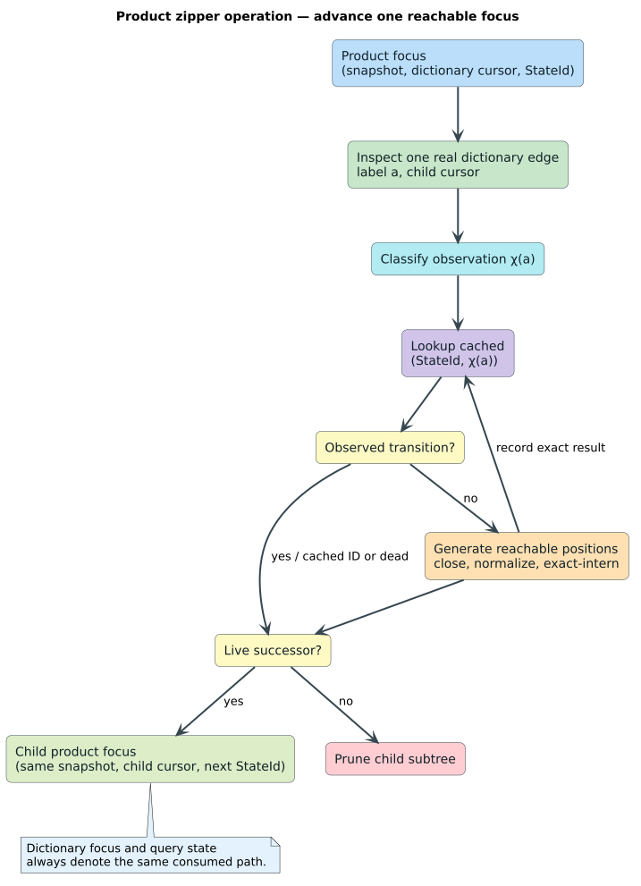

# Lazy ordered-cost product automata

**Status:** theory and design contract · **Scope:** fixed-query string and
finite-series scores · **Metric boundary:** metric laws qualify instances but
do not define the execution architecture

The architecture that makes `liblevenshtein` distinctive generalizes beyond
Levenshtein distance, but not by translating every score into Levenshtein edit
operations. Each score keeps its own recurrence, cost algebra, finite carry,
ground distance, and lawful domain. What generalizes is the representation of
the recurrence's remaining behavior: construct query-specialized residual
states lazily; normalize them into exact antichain frontiers; intern them behind
compact IDs; and explore their synchronized product with a dictionary only
where real dictionary edges demand a transition.

The best working name for this family is **lazy ordered-cost product
automata**. A **metric automaton** is a separately certified member of that
family. This distinction is intentional: banded DTW can use the product and
online architecture although it is nonmetric, while an arbitrary metric need
not have any finite or bounded-memory residual representation.


## 1. Which mathematics is load-bearing?

No single subject is sufficient. The smallest useful synthesis is:

| Mathematics | Exact role here | Priority |
|---|---|---|
| weighted automata and weighted residuals | assign a best cost to each consumed word or finite series and define query-specialized remaining behavior | essential |
| ordered algebra, dioids, and tropical algebra | express alternative choice and path extension for additive and bottleneck recurrences | essential |
| order theory, simulations, and antichains | prove when one live position safely makes another redundant | essential |
| automata theory | define the reachable synchronized product and its language-intersection semantics | essential |
| abstract interpretation | prove interval or box labels are admissible lower simulations of concrete labels | essential for quantized temporal retrieval |
| symbolic and register automata | describe real-valued labels and bounded continuation data without falsely claiming a finite alphabet or finite state set | essential vocabulary for temporal machines |
| coalgebra | specify stepwise observation, chunk equivalence, transactional transitions, and resumption | valuable |
| metric geometry | certify nonnegativity, symmetry, identity on a domain or quotient, and triangle inequality | required only for metric-qualified instances |
| Lawvere-enriched category theory | organize path composition and generalized metrics at a high level | useful explanatory layer, not the implementation proof base |
| set theory and discrete mathematics | provide ambient language for relations, orders, graphs, and finite combinatorics | foundational but too general by themselves |
| calculus | differentiate smooth objectives such as Soft-DTW | outside exact lazy pruning except for analysis-only gradient surfaces |

Weighted-automata theory is the primary semantic base; order theory and
simulation are the primary pruning base; abstract interpretation is the
primary quantization base. Category theory is useful because it reveals common
structure, but forcing the hot implementation through categorical abstractions
would neither prove its recurrence nor make it faster.

## 2. Ordered path costs

Let `C` be a set of exact canonical costs with alternative choice
$`\oplus`$, sequential extension $`\otimes`$, dead value $`\top`$, path
identity $`e`$, and total comparison $`\leq`$:

```math
(C,\oplus,\otimes,\top,e,\leq).
```

The generic proofs require only the laws they use:

1. $`\oplus`$ is associative, commutative, and idempotent;
2. $`\top`$ is the identity for alternative choice;
3. $`a\leq b`$ exactly when $`a\oplus b=a`$;
4. $`\otimes`$ is associative with identity $`e`$;
5. $`\otimes`$ distributes over finite $`\oplus`$ choices;
6. path extension is monotone in both arguments;
7. $`\top`$ is absorbing for extension; and
8. every lawful extension is nondecreasing, or the kernel supplies an
   independently proved future lower bound.

Additive edit and elastic recurrences use the tropical min-plus instance:

```math
a\oplus b=\min(a,b),\qquad
a\otimes b=a+b,\qquad e=0,\qquad\top=\infty.
```

Discrete Fréchet uses a bottleneck min-max instance:

```math
a\oplus b=\min(a,b),\qquad
a\otimes b=\max(a,b),\qquad e=0,\qquad\top=\infty.
```

The crate's `CostMonoid` deliberately exposes the path-extension portion and
keeps minimum selection fixed. A general public semiring or quantale would
promise laws and operations that the acyclic bounded algorithms do not need.
Quantales become relevant only if a future design gives genuine infinite paths
limit semantics.

Floating-point costs are not quotient values under numerical tolerance. The
canonical carrier rejects NaN and invalid infinities, normalizes negative zero,
uses exact structural equality for identity, and uses total ordering for
canonical sort. Epsilon equality is forbidden for interning, dominance, and
cutoff membership.

For cutoff $`\tau`$, define the saturation map:

```math
T_\tau(c)=
\begin{cases}
c & c\leq\tau,\\
\top & c>\tau.
\end{cases}
```

The lawful transition family is **cutoff-congruent** when:

```math
T_\tau(T_\tau(a)\otimes w)=T_\tau(a\otimes w).
```

**Theorem schema CA-1 (cutoff-pruning preservation).** If extension is
monotone and cutoff-congruent, saturating every over-cutoff partial cost
preserves all outputs at or below $`\tau`$. With an admissible completion
estimate $`h(p)`$, the stronger guard $`c_p\otimes h(p)>\tau`$ is sound only
after proving $`h(p)`$ no greater than every lawful completion from $`p`$.
Negative rewards and negative cycles are immediate counterexamples.

## 3. Residuals are the generalized automaton states

Fix a finite query $`q`$, lawful parameters $`\theta`$, and cutoff $`\tau`$.
Let $`F_{q,\theta,\tau}(y)`$ be the exact score truncated to an explicit
over-cutoff value. After consuming target prefix $`u`$, define its residual:

```math
F_u(z)=F_{q,\theta,\tau}(uz).
```

Prefixes $`u`$ and $`v`$ are behaviorally equivalent when every future suffix
has the same score:

```math
u\equiv v
\quad\Longleftrightarrow\quad
\forall z,\ F_u(z)=F_v(z).
```

The ideal deterministic state is a residual-equivalence class. Its transition
is the weighted derivative:

```math
\delta([u],a)=[ua].
```

This is the quantitative analogue of language left quotients and Brzozowski
derivatives. A classic Levenshtein frontier, weighted positional frontier,
temporal DP column, sparse row/cost set, previous-target register, and timestamp
register are different concrete representations of the same kind of object:
the information from the consumed prefix that can still affect every possible
continuation.

**Theorem schema RM-1 (residual realization).** After consuming $`u`$, the
canonical derivative machine is in residual $`\partial_u F`$, and its output
is $`F(u)`$.

**Theorem schema RM-2 (deterministic residual minimality).** Every reachable
deterministic cost-output machine realizing $`F`$ maps behavior-preservingly
onto the reachable residual classes. If the residual index is finite, the
derivative machine is the minimal reachable deterministic Moore machine for
$`F`$. This is not a minimality claim for weighted NFAs or arbitrary linear
semiring representations, and exact structural interning does not claim it has
discovered the complete residual quotient.

The architecture therefore has a precise applicability criterion:

> A score is applicable when each fixed-query, bounded-cutoff residual has an
> effective exact or admissibly abstract representation whose retained size is
> independent of the consumed target-prefix length.

This criterion is stricter than metricity and weaker than being a traditional
finite-state automaton. Strings under a fixed integer edit bound can have a
finite symbolic quotient. Real-valued series commonly require a symbolic
weighted machine with finitely many registers or bounded rolling rows; its
concrete state set may be infinite even though its retained memory is stable.

## 4. Canonical frontiers and proved subsumption

A practical residual representation is a finite frontier:

```math
S=(\kappa,\{p_1,\ldots,p_n\}),
```

where $`\kappa`$ is all finite continuation context and a position contains a
query coordinate, recurrence phase, and accumulated cost. Let $`B_p(z)`$ be
the least completion cost from $`p`$ on suffix $`z`$. The authoritative
continuation preorder is:

```math
p\preceq q
\quad\Longleftrightarrow\quad
\forall z,\ B_p(z)\leq B_q(z).
```

If $`p\preceq q`$, then $`q`$ is redundant in a minimum-cost frontier. An
executable local rule is legal only when it implies this semantic relation. A
common sufficient proof constructs a forward simulation: $`p`$ has no worse
final output and can match every transition from $`q`$ into another related
pair. A zero-target-consumption path from $`p`$ to $`q`$ is an especially
useful kernel-specific witness.

The classical Levenshtein position/error formula is one such theorem; it is
not a generic rule for MSM, ERP, TWED, or Fréchet. If a kernel has no stronger
simulation proof, it may merge exact duplicates and nothing more.

Let $`P_{q,\tau}`$ be the reachable live position preorder. Define its maximum
antichain width:

```math
W(q,\tau)=\sup\{|C|\mid C\subseteq P_{q,\tau}
\text{ and }C\text{ is an antichain}\}.
```

**Theorem schema AW-1 (frontier-width bound).** Every normalized reachable
frontier contains at most $`W(q,\tau)`$ positions. This bounds one frontier,
not the total number of distinct canonical states interned during a branching
dictionary search. Kernel-specific order structure may permit a tighter
linear or ordered normalization; no such complexity improvement is inherited
from the generic theorem alone.

Normalization $`N`$ must prove:

```math
\operatorname{behavior}(N(S))=\operatorname{behavior}(S),
\qquad N(N(S))=N(S),
\qquad N(S)=N(\pi(S))
```

for every predecessor-enumeration permutation $`\pi`$. The representation is
sorted, duplicate-free, deterministic, and complete for every piece of future
context. Witness-carrying states additionally use a specified canonical
tie-order; equal score alone cannot authorize changing the promised witness.

## 5. Exact and abstract query transitions

An exact point transition must correspond to the independent recurrence after
one additional target label. For an exact query automaton $`A_{q,\tau}`$:

```math
L(A_{q,\tau})=\{y\mid F_{q,\theta}(y)\leq\tau\}.
```

A quantized temporal edge instead denotes a concrete set. If abstract label
$`\hat a`$ has concretization $`\gamma(\hat a)`$, the abstract transition must
lower-simulate every concrete member:

```math
\forall a\in\gamma(\hat a),\qquad
\operatorname{step}^{\#}(S^{\#},\hat a)
\;R\;
\operatorname{step}(S,a),
```

where $`R`$ guarantees the abstract cost never exceeds the corresponding
concrete cost. Singleton abstraction is exact:

```math
\operatorname{step}^{\#}(S^{\#},[a,a])
\equiv \operatorname{step}(S,a).
```

This is abstract interpretation: intervals or boxes form an abstract domain,
and transition soundness is a lower simulation. A Galois connection is useful
for structuring the proof, but the executable obligation is the quantified
lower-bound inequality.

An interval product recognizes a candidate superset, not the exact metric
ball. Exact scoring of every full-precision member of every quantization-
collision bucket removes false positives and is the sole authority for emitted
distance and membership.

Order abstract labels by precision:

```math
\hat a_1\sqsubseteq\hat a_2
\quad\Longleftrightarrow\quad
\gamma(\hat a_1)\subseteq\gamma(\hat a_2).
```

**Theorem schema AP-1 (candidate monotonicity under refinement).** If the
abstract transformer is precision-monotone, replacing every label by a more
precise abstraction in a completed search can remove false-positive
candidates but cannot remove an exact within-cutoff result. The theorem is not
stated for partial pages under unequal budgets because tighter bounds can
change scheduling and therefore the point at which execution pauses.

Independent interval products can lose correlations needed by adjacent-target
recurrences. Soundness survives when their concretization is a superset of all
feasible correlated points, though pruning may weaken. Timestamped TWED may
benefit from a relational domain carrying $`t_{j-1}<t_j`$ or a timestamp-
difference interval; an interval box itself cannot certify validity of stored
original timestamps.

## 6. Lazy synchronized products

Let dictionary edge $`n\xrightarrow{b}n'`$ carry label $`b`$, and let decoding
$`\chi_q`$ translate it into a query observation. The product step is:

```math
(n,S)\xrightarrow{b}
(n',\operatorname{step}(S,\chi_q(b))).
```

When both components are exact acceptors, the product's accepted language is
their intersection. With abstract interval query states, the product first
accepts a sound candidate superset and exact leaf verification restores exact
result semantics.

The Cartesian set of possible pairs is never materialized. A search session
stores dictionary cursor/path data and one machine-word `StateId`. The ID
refers into a collision-checked canonical arena, and an observed-transition
cache maps $`(\mathrm{StateId},\text{ exact observation key})`$ to a successor
ID or dead state.

The defining laziness property is:

> Every constructed query transition is demanded by an inspected outgoing
> edge of a reachable dictionary-product state. No pair is created merely
> because it could exist.

This gives the architecture its output-sensitive character. Prefix sharing
avoids rescoring descendants from scratch, subsumption reduces live width,
exact interning shares repeated residual representations, and observation
caching shares repeated transitions. None of those optimizations changes the
score recurrence.

On a trie, a node commonly identifies one prefix. On a DAWG or another graph
with shared suffixes, two distinct prefixes can reach the same dictionary node.
Memoizing only `(`dictionary node`, `StateId`)` is therefore unsound when keys,
stable IDs, values, or witnesses depend on path identity. Such pair
deduplication requires a backend-specific suffix-congruence theorem and a
correct multiplicity/reconstruction mechanism; otherwise each pending product
item retains a compact path identity even though query transitions are shared.

**Theorem schema BF-1 (best-first kNN stopping).** Once $`k`$ exact results
exist, an admissible-bound heap may stop when its smallest queued bound is
strictly greater than the canonical $`k`$th exact cost. Equality is insufficient
when an unseen equal-cost result may win the deterministic stable-ID tie order.

## 7. Operations, cursors, and product zippers

The theory applies to operations as well as states. A query engine is correct
only if dictionary navigation, query transitions, product construction, and
result verification compose without changing their individual meanings.

### 7.1 A zipper is the focused dictionary component

A **dictionary zipper** is a persistent focus into one captured dictionary
revision. Abstractly, write:

```math
Z_D=(\sigma,n,\rho),
```

where $`\sigma`$ identifies the immutable snapshot, $`n`$ is the focused
dictionary node or backend cursor, and $`\rho`$ is the minimal context needed
for navigation or path reconstruction. A classic Huet zipper factors a tree
into a focused subtree and a one-hole context; dictionary implementations may
instead use node IDs, persistent trie references, parent spines, or backend-
native cursors, but they must satisfy the same observational navigation laws.

The dictionary operations are:

```math
\operatorname{children}:Z_D\longrightarrow
\operatorname{FiniteSeq}(A\times Z_D),
```

```math
\operatorname{descend}:Z_D\times A\longrightarrow
\operatorname{Option}(Z_D),
```

```math
\operatorname{final}:Z_D\longrightarrow\mathbb{B},
\qquad
\operatorname{value}:Z_D\longrightarrow\operatorname{Option}(V).
```

For path $`u`$ and label $`a`$, the required laws are:

1. **snapshot scope:** every descendant retains the same $`\sigma`$;
2. **descent soundness:** successful `descend(z,a)` focuses exactly path
   $`ua`$ in $`\sigma`$;
3. **child completeness:** `children(z)` enumerates every and only successful
   labelled descents, once each;
4. **final/value coherence:** finality and values are those of $`u`$ in
   $`\sigma`$;
5. **persistent cloning:** copying a zipper does not mutate or invalidate
   either focus; and
6. **path coherence:** if paths are exposed, reifying the child path appends
   exactly its edge label.

A query scheduler may consume a zipper into an **opaque traversal focus** that
retains only $`(\sigma,n)`$. Erasing $`\rho`$ is sound precisely when the opaque
view exposes no zipper-path operation, finality and descent factor through
$`(\sigma,n)`$, and the scheduler records its own root-relative parent trace.
The result path is then reconstructed from that trace. This is not permission
to drop path-sensitive dictionary semantics: a backend whose visibility or
value depends on the complete key must retain or recheck those units through
its documented final-admission operation.

These specialize the snapshot laws in
[snapshot semantics](snapshot-semantics.md). They authorize $`\mathcal{O}(1)`$
snapshot capture, immutable structural sharing, cheap focus copies, and
continuations that outlive the original dictionary handle.

There is a genuine connection to calculus, but it is **algebraic data-type
differentiation**, not differential calculus on metric costs. For a polynomial
data type functor $`F`$, the formal derivative $`F'`$ describes one-hole
contexts; a focused value has the conceptual shape $`F\times F'`$. This
explains Huet-style zippers and their compositional navigation. It does not
derive MSM/TWED/Fréchet recurrences or license numeric pruning.

### 7.2 The query-operation algebra

For a query machine, distinguish the following operations rather than hiding
them behind one unconstrained transition method:

| Operation | Semantic duty | Principal optimization it may authorize |
|---|---|---|
| `seed` | represent the empty target prefix | precomputed query plan and initial closure |
| `classify` | map a concrete edge label to an exact observation class | characteristic vectors, interval-bin IDs, vector boxes |
| `generate` | construct reachable consuming successors | sparse position generation |
| `close` | add every required zero-input successor | iterative ranked worklist |
| `normalize` | preserve behavior while canonicalizing and subsuming | antichain width reduction |
| `intern` | assign one ID to exactly equal canonical states | compact queued product pairs |
| `step` | compose classify, generate, close, normalize, and intern | observed-transition cache |
| `lower_bound` | never exceed any represented exact completion | subtree pruning and priority scheduling |
| `relaxed_final` | admit every potentially exact final | candidate gate only |
| `exact_verify` | compute authoritative concrete cost and witness | exact emission and deterministic ties |

The corresponding laws are transition correspondence, classification
congruence, closure completeness and idempotence, normalization preservation,
collision-safe interning, lower-bound admissibility, and exact final
authority. In full generality classification may be state-relative,
$`\chi:S\times A\to O`$; query-wide characteristic classes are the simpler
state-independent case. Observation classes are cacheable only under:

```math
\chi(S,a)=\chi(S,b)
\Longrightarrow
\operatorname{step}(S,a)=\operatorname{step}(S,b)
```

for every lawful canonical state $`S`$. An interval label generally fails this
equality for exact concrete transitions; it instead uses the abstract lower-
simulation relation from Section 5.

A cached value is either a complete successor ID or a semantic dead marker.
Budget-exceeded and allocation-failed outcomes are not semantic transitions
and must not be cached unless every resource/configuration dependency is part
of the key. Under exact state decode, transition purity, immutable arena
entries, and complete keys, cache hits refine recomputation; eviction affects
performance only.

### 7.3 A product zipper is a focused reachable pair

A **product zipper** combines one dictionary focus with one compact query
state:

```math
Z_{D\otimes A}=(Z_D,\operatorname{StateId},\omega),
```

where $`\omega`$ is optional bounded path/witness context. Its child operation
is not an arbitrary Cartesian-product enumeration:

```math
\operatorname{child}((z,s),a)=
\begin{cases}
(\operatorname{descend}(z,a),\operatorname{step}(s,\chi(a)))
  & \text{if both successors exist and the query state is live},\\
\bot & \text{otherwise.}
\end{cases}
```



Historically named `IntersectionZipper` values are therefore operationally
product zippers. “Intersection” remains correct for the exact accepted
language, but “product” is the precise name for the focused state and its
transition construction.

The product zipper laws are:

1. its dictionary and query components denote the same consumed path;
2. a live child exists exactly when the dictionary edge exists and the query
   transition survives;
3. every enumerated child is reachable;
4. child enumeration is complete for all live outgoing edges;
5. final emission requires dictionary finality, exact query authority, and an
   explicit $`d\leq\tau`$ admission check after all trailing query-only
   operations have been closed;
6. cloning or suspending a product focus preserves its snapshot identity; and
7. rebuilding from a continuation is observationally equivalent to retaining
   the live focus.

Child-handle construction may be delayed until after the query transition.
Let $`q(s,a)`$ be the optional query successor and $`d(z,a)`$ the optional
dictionary descent. The ordinary and projection-first forms are:

```math
\operatorname{pair}(d(z,a),q(s,a))
\quad\text{and}\quad
q(s,a)\mathbin{\mathrm{andThen}}(s'\mapsto
d(z,a)\mathbin{\mathrm{map}}(z'\mapsto(z',s'))).
```

They are equal because both operations are pure on the same label and captured
revision. Consequently a dead query projection constructs zero owned child
foci, while every live existing edge constructs exactly one. This law is the
formal basis of `DictZipper::filter_map_children`: it is an allocation-order
optimization, not an additional pruning rule.

These laws make zippers an optimization boundary. A backend may use a borrowed
node cursor for a tight local walk, a persistent value zipper for suspension,
or a compact serializable continuation for paging, provided all three are
observationally equivalent. Path materialization can be delayed until a result
or witness needs it. Sibling enumeration can batch edge labels and reuse a
prepared query row. Parent contexts can be shared rather than cloning complete
paths. None of these representation choices may change snapshot revision,
child order where order is promised, exact key identity, or result ties.

### 7.4 Schedulers are operations over the same product

DFS, BFS, distance-layer, and best-first traversal are scheduling policies over
reachable product zippers. They are interchangeable only when the public
observation allows it:

- unordered exact range results permit any fair exhaustive schedule;
- lexicographic or ranked results require the corresponding deterministic
  priority and tie order;
- kNN requires an admissible lower-bound heap and may stop only when no queued
  bound can improve the exact retained neighbors; and
- a bounded schedule must return a continuation before exceeding its ledger,
  never silently truncate.

Thus a scheduler optimization is a refinement theorem, not merely a container
swap. Its proof relates pending frontier, emitted prefix, exact tie order,
resource ledger, and immutable snapshot at every step.

## 8. Online semantics, stability, and stack safety

An online machine fixes a finite query and consumes an unknown number of target
labels. It reports the exact or tagged bounded status of every finite prefix.
This is a coalgebraic transition system of the form:

```math
\operatorname{step}:S\times A\longrightarrow
\operatorname{Outcome}(O\times S).
```

For query length $`m`$, maximum target lookback $`r`$, and maximum live
frontier width $`w(q,\tau)`$, retained state obeys:

```math
M(t)\leq M_{\mathrm{query}}(m)+\mathcal{O}(w(q,\tau))+\mathcal{O}(r)
```

for every consumed prefix length $`t`$. Dense rolling recurrences have
$`w=\mathcal{O}(m)`$; sparse frontiers may be smaller. No universal
cutoff-only width is claimed for kernels with zero-cost paths.

There are two deliberately different resource profiles:

- **stream machine:** current and next generations, bounded lookback, bounded
  scratch, and no historical state arena or unbounded transition cache;
- **search session:** bounded arena, cache, queue/stack, results, witnesses, and
  continuation because dictionary branches may revisit representations.

Each transition is transactional: validate and preflight checked work and
allocation limits, construct into scratch, then commit. A rejected step leaves
the prior state observable and unchanged. Chunking a stream cannot change the
result, and resuming a paused dictionary search must equal uninterrupted
execution over the same immutable snapshot.

All closures and traversals are iterative. Zero-input operations use a
well-founded rank or an explicitly bounded worklist. Dictionary DFS uses a
bounded heap stack rather than the process call stack. Its memory can still
grow with live dictionary depth, so stack safety is not mislabeled as constant
heap memory.

This contract does not define a distance between completed infinite sequences.
It defines stable processing of every finite prefix of an unknown-length target
against one fixed finite query. Bilaterally growing exact histories require a
separate windowed or infinite-path semantics.

## 9. Metric qualification is a separate theorem

The generic engine is an `OrderedCostAutomaton`, not inherently a metric
automaton. A sealed audited metric marker requires proofs, on the exact
documented domain or quotient, of:

```math
d(x,y)\geq0,
\qquad d(x,y)=d(y,x),
\qquad d(x,y)=0\Longleftrightarrow x\sim y,
\qquad d(x,z)\leq d(x,y)+d(y,z).
```

Here $`\sim`$ is ordinary equality for strict metrics and the declared quotient
relation for ERP or discrete Fréchet. These laws are necessary for algorithms
whose correctness uses metric geometry. They are not required for synchronized
trie traversal, an admissible interval lower bound, or exact leaf verification.

The separation produces two important controls:

- banded DTW may pass product, online, resource, and recurrence-correspondence
  gates but can never satisfy the metric marker;
- raw ERP and raw Fréchet remain pseudometrics, while their gap-value and
  consecutive-stutter quotients may receive a metric-qualified wrapper.

Fixed positive multichannel composition is a theorem above the scalar metric
instances:

```math
D(X,Y)=\sum_{c=1}^{C}w_c\,d_c(S_cX_c,S_cY_c),
\qquad w_c>0.
```

Fold-local transforms $`S_c`$, channel identities, and weights are fixed for
every compared pair. Zero weights produce a quotient; pair-dependent missing-
channel renormalization is not covered and remains a counterexample control.

## 10. Applicability matrix

| Family | Ordered algebra | Residual representation | Required context | Qualification |
|---|---|---|---|---|
| standard Levenshtein | min-plus integers | positional error antichain | edit variant | metric |
| weighted strings | min-plus canonical cost | weighted positional frontier | operation/continuation kind | conditional on lawful symmetric positive costs |
| MSM | min-plus real | sparse query-row frontier | preceding target point or interval | metric for lawful positive split/merge cost |
| ERP | min-plus real | sparse query-row frontier | gap configuration | metric on the gap-value quotient |
| unit-grid TWED | min-plus real | query-row frontier | preceding target point and depth | metric under lawful positive stiffness on uniform grids |
| timestamped TWED | min-plus real | timestamp-aware frontier | preceding value/time and typed units | metric on finite strictly monotone canonical-unit inputs |
| scalar/vector discrete Fréchet | min-max | bottleneck row frontier | current point/interval | metric on the consecutive-stutter quotient when the ground metric is certified |
| banded DTW | min-plus real | band-restricted row frontier | band/depth and current label | explicitly nonmetric |
| Soft-DTW | smooth log-sum-exp recurrence | rolling dense score rows | bounded DP history | analysis-only; idempotent antichain elimination does not apply |

Metricity is neither necessary nor sufficient. A new score enters the generic
architecture only after its residual, transition, cutoff, context, and resource
contracts are defined and proved.

## 11. Theory-directed optimization

The theory is intentionally constructive: each semantic equivalence or order
law identifies a concrete optimization and its correctness condition.

| Theorem or law | Optimization | Required control |
|---|---|---|
| residual representation | discard consumed target history | every future score factors through retained state |
| residual equivalence | exact state minimization/interning | collision-checked structural equality or a proved complete quotient |
| continuation simulation | antichain subsumption | local rule implies the suffix-quantified preorder |
| observation congruence | characteristic-class transition cache | equal classes induce exactly equal successors |
| cutoff monotonicity | dead-state and subtree pruning | no lawful completion can lower the bound beneath cutoff |
| abstract lower simulation | interval/box traversal | exact verification covers every concrete collision member |
| point-abstraction exactness | specialized point transitions | point and abstract paths are observationally equal |
| product reachability | on-demand construction | transitions arise only from inspected reachable edges |
| zipper navigation laws | opaque native focus, projection-before-child, shared parent arena | snapshot/path/finality observations remain equal |
| sibling independence | prepared rows and batched child labels | scratch is reset transactionally between labels |
| coalgebraic state sufficiency | current/next generations and cache reclamation | chunk partitions and long prefixes are observationally equal |
| scheduler refinement | select DFS, BFS, layers, or best-first by query | completeness, order, cutoff, and continuation obligations remain true |
| witness congruence | compact parent operation IDs and delayed replay | canonical replay produces the promised exact cost and tie key |

Let $`E_R`$ be the number of inspected edges in the reachable live product,
$`S_R`$ the number of distinct canonical query states, $`C_R`$ the number of
distinct observed state/class transitions, $`W`$ the maximum frontier width,
$`H`$ the maximum live DFS depth, and $`V`$ the number of full-precision
candidates verified. A useful implementation-sensitive accounting is:

```math
T=\mathcal{O}\!\left(
E_R\,c_{\mathrm{lookup}}
+C_R\,c_{\mathrm{generate}}(W)
+V\,c_{\mathrm{exact}}
\right),
```

```math
M_{\mathrm{search}}=
\mathcal{O}(S_R W+C_R+Q+H+R+\Omega),
```

where $`Q`$ is pending scheduler storage, $`R`$ retained results, and
$`\Omega`$ bounded witness/continuation storage. This is not a claim of
dictionary-size independence: a query with weak pruning may inspect the whole
dictionary. It is an accounting that reveals whether time is spent generating
new residuals, revisiting known observations, verifying quantization
collisions, or maintaining the scheduler.

For a stream machine the stronger retained-memory equation is:

```math
M_{\mathrm{stream}}=
M_{\mathrm{query}}+\mathcal{O}(W+r+\mathrm{scratch}+C_{\mathrm{bounded}}),
```

independent of consumed prefix length. Search arenas and their $`S_R`$ term do
not belong in this profile.

Optimization work should therefore measure more than wall time:

- constructed and reused state IDs;
- transition-cache hits, misses, and exact collision comparisons;
- generated, closed, and subsumed positions per observed edge;
- reachable dictionary edges inspected and subtrees pruned;
- peak stream generations, search states, queue frames, and path bytes;
- abstract candidates, quantization-collision members, and exact survivors;
- exact-verifier calls and witness operations; and
- tagged budget exits, continuation bytes, allocations, and peak resident set.

A performance change is accepted only after the slow recurrence oracle and
formal-model-aligned properties remain equal, its relevant mutant remains
rejected, and benchmarks show improvement in the work dimension the theorem
predicts. Examples include packed IDs, `SmallVec` frontiers, generation-stamped
scratch, sparse/dense adaptive stepping, SIMD dominance checks, interval-table
precomputation, and dictionary-native cursor batches. None is allowed to alter
exact equality, cutoff membership, deterministic ties, or fail-closed limits.

## 12. Formal theory and executable gates

### 12.1 Normative theorem-schema registry

The identifiers below name obligations, not blanket claims that every instance
has already discharged them. The
[`FORMAL_VERIFICATION_MANIFEST.tsv`](../verification/FORMAL_VERIFICATION_MANIFEST.tsv)
is authoritative for current proof status.

| ID | Schema | Required evidence |
|---|---|---|
| CA-1 | cutoff saturation preserves every at-or-below-cutoff output | ordered-algebra proof plus over-cutoff mutant |
| FA-1 | finite finalizer output is emitted only when it remains within cutoff | exact finalization plus scheduler-boundary admission proof and mutant |
| RM-1 | transitions realize weighted left residuals | kernel recurrence correspondence |
| RM-2 | reachable deterministic residual quotient is minimal | generic Moore-machine proof; no NFA-minimality claim |
| SP-1 | semantic dominance permits atom elimination | suffix-quantified continuation proof |
| SP-2 | executable forward simulation implies semantic dominance | kernel/variant-specific simulation |
| AN-1..3 | normalization preserves behavior, is idempotent, and is permutation-independent | formal canonicalization plus randomized predecessor order |
| AW-1 | normalized frontier width is bounded by reachable-poset width | order-theoretic instance analysis |
| OC-1 | transition-congruent observation quotient preserves behavior | label-class correspondence |
| CC-1 | exact observed-transition cache refines recomputation | exact state decode, complete cache key, pure transition |
| CC-2 | eviction of complete cache entries is behaviorally transparent | recomputation equivalence |
| AI-1 | abstract transitions lower-simulate all concrete paths | interval/box transformer induction |
| AI-2 | an over-cutoff abstract bound safely rejects a subtree | AI-1 plus cutoff-safe extension |
| AI-3 | singleton/point abstractions reproduce exact transitions | point correspondence and mutant |
| AP-1 | greater abstract precision cannot lose completed exact results | precision monotonicity plus complete execution |
| EV-1 | candidate product plus collision retention and verification equals brute force | product completeness and exact verifier |
| MQ-1 | exact distance realization recognizes the cutoff ball | RM-1 and exact finality |
| MQ-2 | fixed positive channel sums preserve metric laws | qualified component metrics and fixed domains |
| ZP-1..7 | zipper snapshot, path, child, finality, clone, and continuation laws | backend conformance and product-focus model |
| GR-1..3 | bounded-lookback reclamation, prefix-independent retention, and generation-tag safety | recurrence dependency and ring-buffer refinement |
| ST-1 | arbitrary stream chunking equals one uninterrupted run | coalgebraic composition plus executable property |
| TX-1 | rejected transition preflight leaves committed state unchanged | resource refinement and fault injection |
| PS-1..5 | reachability, completeness, soundness, scheduler independence, and lazy construction | product proof plus bounded lifecycle model |
| BF-1 | admissible best-first kNN stopping is exact with tie discipline | lower-bound and ordering proof |
| BO-1..2 | complete outcomes are fail-closed and resumption equals uninterrupted execution | TLA+ lifecycle plus executable pages |

### 12.2 Proof dependency

The main semantic dependency is:

```math
\text{cost algebra}
\to\text{residual correspondence}
\to\text{simulation dominance}
\to\text{canonical antichains}
\to\text{observation quotient/cache}
\to\text{abstract lower simulation}
\to\text{lazy product}
\to\text{exact verification}
\to\text{bounded resumption}.
```

Metric qualification and streaming stability are parallel branches:

```math
\text{exact recurrence}+\text{domain/quotient laws}
\to\text{metric marker}
\to\text{triangle-dependent consumers},
```

```math
\text{bounded lookback}+\text{generation tags}+\text{transactional limits}
\to\text{prefix-independent retention}.
```

This structure prevents one local inequality, recurrence lemma, or metric proof
from being reported as verification of the entire query implementation.

The proof program proceeds in dependency order:

1. prove ordered-algebra choice, extension monotonicity, dead absorption, and
   kernel recurrence correspondence;
2. prove the seed represents the empty prefix and one transition preserves the
   residual-representation relation;
3. prove exact duplicate merging and every stronger dominance rule preserve
   continuation behavior;
4. prove canonicalization is idempotent, permutation-independent, and exact;
5. prove abstract transitions lower-simulate every concrete label and point
   abstractions reproduce exact transitions;
6. prove every queued pair is reachable and every live edge is eventually
   explored unless the outcome is explicitly incomplete;
7. prove abstract candidate enumeration plus collision retention plus exact
   leaf scoring equals brute force;
8. prove collision-safe interning, checked counters, transactional budget
   rejection, pause/resume equivalence, stack safety, and prefix-independent
   stream retention;
9. separately prove the metric axioms for each qualified domain or quotient.

Rocq carries the semantic spine. Verus connects Rust-shaped arrays, arenas,
and checked transitions to those relations. Z3 and cvc5 discharge local
arithmetic obligations and pinned mutants. TLA+ checks scheduler lifecycle,
continuations, resource outcomes, and the impossibility of reporting an
incomplete or invalid search as complete empty.

Every executable instance also has independent-oracle properties: exact score
after every prefix, arbitrary chunk equivalence, interval lower bounds, point-
interval equality, brute-force range/kNN equality, hash/permutation
determinism, collision retention, witness replay, corruption failure, and
configured resource ceilings. Optimization is accepted only as a refinement
that preserves these observations.

## 13. Property and mutation program

Formal models state the unbounded mathematical obligations; executable
properties connect them to Rust, binary64 carriers, dictionary backends, and
resource failures.

### 13.1 Generic properties

1. Every online prefix equals an independent batch scorer.
2. Every arbitrary stream chunk partition equals uninterrupted execution.
3. Normalization is idempotent and permutation-independent.
4. Pruned and unpruned frontiers have equal exact outputs.
5. Equal canonical states reuse one ID; unequal states never do.
6. Forced fingerprint collisions do not merge unequal states.
7. Observation-cache hits equal direct recomputation.
8. Cache eviction changes no completed result.
9. Interval transitions lower-bound every represented sampled point.
10. Point intervals equal exact point transitions cell by cell.
11. More precise abstractions add no candidates in completed searches.
12. Exact product results equal brute force across dictionary backends.
13. Range membership is monotone in inclusive cutoff.
14. Every finite finalizer score is rechecked against the inclusive cutoff
    before public emission.
15. Every quantization-collision member is retained and exactly verified.
16. Post-warm-up retained online capacity has zero slope with stream length.
17. Rejected budget/resource transitions leave committed state unchanged.
18. Every advertised counter, queue, arena, cache, witness, and result limit is
    respected.
19. Resumed and uninterrupted searches agree for arbitrary page partitions.
20. Every witness replays to the exact returned cost.
21. Ties and result order are stable across hash seeds and snapshot reloads.
22. Dictionary zipper children equal the set of successful labelled descents.
23. Product zipper children equal the live intersection of dictionary and
    query successors.
24. Delayed path materialization equals eager root-to-focus reconstruction.
25. DFS, BFS, and best-first completed result multisets agree where their
    public ordering contracts permit comparison.

### 13.2 Pinned mutants and negative controls

The suite must permanently reject:

- the MSM final cutoff omission;
- the zipper true-Damerau final-admission omission for query `"a"`, key `""`,
  and cutoff zero;
- hash-only state reuse;
- epsilon-based floating canonical equality;
- deletion of a live nonsubsumed atom;
- cross-context subsumption without a carry simulation;
- an incorrect interval endpoint or omitted feasible correlation;
- broken point exactness;
- pruning a cutoff-equal state;
- work charging after evaluation;
- committing before budget/allocation preflight;
- overflow, invalidity, or incompleteness converted to complete empty;
- dropping one quantization-collision original;
- buffering the consumed target prefix;
- accepting a stale generation tag;
- nondeterministic equal-cost witness selection;
- substituting unit-grid indices for explicit physical timestamps;
- an unbounded continuous-observation cache in streaming mode;
- deduplicating a DAWG product pair while losing a distinct path/value;
- allowing DTW to implement the metric marker; and
- zero-weight or pair-renormalized channel composition to pass the positive-
  sum theorem.

## 14. Causal benchmark protocol

Wall-clock time is an outcome, not an explanation. Each benchmark binds commit,
toolchain, features, seed, kernel configuration, limits, snapshot identity, and
source checksums, then records the causal quantities predicted by the theory.

### 14.1 State and observation measures

- raw atoms generated, exact duplicates removed, and atoms removed by each
  named simulation rule;
- frontier width distribution and maximum $`W`$;
- canonical states, total retained atoms, ID reuse, and fingerprint-bucket
  lengths;
- observation classes per state, cache hits/misses/dead hits/evictions, and
  allocations/bytes per entry; and
- cache size and retained-memory slope against stream length.

### 14.2 Abstract-product measures

- abstract bound versus exact cost, including absolute gaps when exact cost is
  zero;
- prefix-, cell-, and leaf-bound prune counts;
- candidate amplification, exact-verification ratio, collision-bucket sizes,
  and exact-survivor count; and
- time spent tightening the abstract domain versus exact verification saved.

### 14.3 Product, zipper, and scheduler measures

- dictionary nodes/edges visited and $`E_R/E`$;
- live successor ratio, transition misses per inspected edge, and prepared-
  sibling reuse;
- maximum worklist, explicit DFS depth, zipper clone bytes, parent-spine/path
  bytes, and delayed materializations;
- queued states later rejected by a tighter kNN cutoff; and
- time to first result, time to completion, and order-normalization cost.

### 14.4 Streaming and witness measures

- current/next capacities, retained generation count, lookback and scratch high-
  water marks, and logical bytes versus prefix length;
- p50/p95/p99 per-symbol work and maximum work charged in one step;
- tagged incomplete transitions under fixed ceilings; and
- witness bytes, checkpoint count, replay work, exact replay time, and tie-group
  size.

Workloads vary query length, cutoff, branching, depth, DAWG sharing,
observation entropy, cache-adversarial label order, repeated zero-cost values,
quantization collisions, vector dimension, timestamp irregularity, DTW band,
and exact/near-cutoff/no-match distributions. Paired controls compare compact
IDs to owned states, cache off/on, duplicate-only to proved subsumption,
coarse/refined abstractions, sparse/dense transitions, DFS/best-first, and
witness off/bounded replay. RSS is reported with logical retained capacity and
allocation counts because allocator page retention can hide the true slope.

## 15. Incremental research program

The theory remains living work. Development proceeds without a big-bang
generic rewrite:

1. **Definitions and traceability.** Stabilize vocabulary; inventory every
   automaton, operation, zipper, and scheduler; map each optimization to a
   theorem, property, mutant, and benchmark.
2. **Residual core.** Formalize deterministic cost-output residual machines,
   RM-1/RM-2, and closed Standard Levenshtein plus minimal temporal instances.
3. **Simulation and antichains.** Prove SP-1/SP-2, AN-1..3, and instance width
   bounds; retain duplicate-only fallback everywhere else.
4. **Observation congruence.** Prove characteristic-vector factorization,
   exact cache refinement, eviction transparency, and bounded policy for
   continuous observations.
5. **Abstract domains.** Formalize interval/box concretization, point
   embeddings, precision monotonicity, and relational timestamp candidates.
6. **Stable online machines.** Prove bounded lookback, generation tags,
   reclamation, chunking, and transactional steps; audit caches and witnesses
   for hidden history growth.
7. **Products and zippers.** Prove focus/navigation laws, reachable worklists,
   scheduler independence, DAWG path sensitivity, best-first stopping, bounded
   continuation, and snapshot binding.
8. **Kernel migration.** Use Standard/weighted strings as references, followed
   by ERP, scalar Fréchet, vector Fréchet, MSM, unit-grid TWED, timestamped
   TWED, and banded DTW as the nonmetric control.
9. **Refinement optimization.** Evaluate exact interning, bounded observation
   caches, packed IDs, sparse scheduling, adaptive sparse/dense transitions,
   refined abstractions, SIMD normalization, replayable witnesses, and
   scheduler specialization one at a time.
10. **Advanced theory.** Investigate synthesis of simulation relations,
    behavioral weighted-residual minimization, symbolic decision diagrams,
    precision refinement driven by candidate amplification, deterministic
    parallel scheduling, proof-carrying witnesses, persistent canonical-state
    snapshots, resumable-session coalgebras, and a Lawvere-enriched summary.

Every migration retains a slower formal-model-aligned or independent matrix
oracle until correspondence, mutation, resource, stack, and causal performance
gates pass.

## 16. Implementation boundary

The implementation should consolidate narrow crate-private infrastructure, not
replace specialized hot recurrences with one dynamic abstraction:

- exact canonical state arena and compact IDs;
- collision-checked fingerprints;
- observed-label transition caches;
- reusable current/next scratch and bounded worklists;
- iterative bounded product schedulers;
- tagged stream and search outcomes;
- exact leaf-verifier adapters; and
- sealed, reviewed metric qualification.

Kernel-specific machines remain monomorphized. They own query preparation,
recurrence context, exact observation keys, legal epsilon reachability,
subsumption proofs, finality, and exact scoring. This preserves both semantic
clarity and optimization freedom.

## 17. Explicit nonclaims

- Not every metric admits this architecture.
- A symbolic real-valued temporal machine need not be finite-state in the
  strict automata-theory sense.
- A quantized interval product is not exact language intersection until every
  candidate original has been exactly verified.
- No numerical-tolerance or intuitive dominance rule is sound by default.
- Stack-safe traversal can still need bounded heap memory proportional to live
  dictionary depth.
- Stable fixed-query prefix processing is not an infinite-sequence distance.
- A budget-exceeded, invalid, overflowed, or approximate result is never a
  complete empty result.
- Soft-DTW does not inherit the idempotent minimum-antichain theory.
- Named proof islands do not imply that every historical MSM surface is fully
  formally verified.

## 18. References

- M. Droste, W. Kuich, and H. Vogler, editors, *Handbook of Weighted
  Automata*, Springer, 2009.
  [doi:10.1007/978-3-642-01492-5](https://doi.org/10.1007/978-3-642-01492-5)
- J. A. Brzozowski, “Derivatives of Regular Expressions,” *Journal of the ACM*
  11(4), 1964.
  [doi:10.1145/321239.321249](https://doi.org/10.1145/321239.321249)
- L. Doyen and J.-F. Raskin, “Antichain Algorithms for Finite Automata,”
  *TACAS*, 2010.
  [doi:10.1007/978-3-642-12002-2_2](https://doi.org/10.1007/978-3-642-12002-2_2)
- P. Cousot and R. Cousot, “Abstract Interpretation: A Unified Lattice Model
  for Static Analysis of Programs by Construction or Approximation of
  Fixpoints,” *POPL*, 1977.
  [doi:10.1145/512950.512973](https://doi.org/10.1145/512950.512973)
- J. J. M. M. Rutten, “Universal Coalgebra: A Theory of Systems,”
  *Theoretical Computer Science* 249(1), 2000.
  [doi:10.1016/S0304-3975(00)00056-6](https://doi.org/10.1016/S0304-3975(00)00056-6)
- F. W. Lawvere, “Metric Spaces, Generalized Logic, and Closed Categories,”
  *Rendiconti del Seminario Matematico e Fisico di Milano* 43, 1973.
  [doi:10.1007/BF02924844](https://doi.org/10.1007/BF02924844)
- G. Huet, “Functional Pearl: The Zipper,” *Journal of Functional
  Programming* 7(5), 1997.
  [doi:10.1017/S0956796897002864](https://doi.org/10.1017/S0956796897002864)
