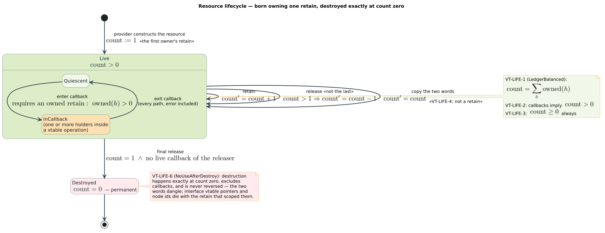

# Snapshot semantics — the cursor laws and their persistence-theory basis

Every liblevenshtein query — Rust iterator, resource-ABI cursor, or C-ABI
lease stream — obeys one contract: **it observes exactly the dictionary
revision visible at query start, forever, at** $`\mathcal{O}(1)`$
**capture cost, without blocking writers.** This document states that
contract as precise laws, derives why an $`\mathcal{O}(1)`$ capture is
possible at all (persistent data structures), classifies the design in
Driscoll-Sarnak-Sleator-Tarjan's persistence taxonomy, traces the
reference-counting lineage that makes cursors outlive their sources, and
maps every law to its formal model and its executable tests.

---

## 1. Definitions

All terms are defined before use; interop-level terms follow the
[family canon](../../vinary-tree-interop/docs/abi-reference.md#1-terms).

| Symbol / term | Definition |
|---|---|
| dictionary $`D`$ | A finite set of terms over a unit domain (bytes, Unicode scalars, or `u64` tokens), each term optionally carrying a `u64` value. Mutable: insert, remove, update, clear, compact, checkpoint. |
| revision $`D_t`$ | The logical value of the dictionary at time $`t`$: the exact term-value set an observer at $`t`$ would read. |
| snapshot $`\sigma`$ | An immutable object that pins one revision: reads through $`\sigma`$ answer against $`D_{t_0}`$ for the capture time $`t_0`$, regardless of later mutation. |
| cursor | A lazy match stream created by a query; it owns one snapshot and yields matches on demand. |
| query-start boundary | The instant $`t_0`$ at which a query captures its snapshot — **before reading the root**. Everything the cursor ever emits is decided by $`D_{t_0}`$. |
| structural sharing | Building a new revision by allocating only the path from the changed node to the root and sharing every untouched subgraph with the previous revision. |
| path copying | The specific structural-sharing method used here: a mutation copies the nodes on the root-to-change path (out-degree-bounded), leaving all other nodes shared. |
| ephemeral / partially persistent / fully persistent | Driscoll et al.'s taxonomy [[1]](#7-references): an *ephemeral* structure loses past versions on update; a *partially persistent* one allows reads of **every** past version but updates only the newest; a *fully persistent* one allows updates to any version (branching histories). |
| $`d(q, w)`$ | The edit distance of the configured algorithm (Levenshtein, OSA, unrestricted Damerau, merge-and-split) between query $`q`$ and term $`w`$. |
| $`\mathrm{live}_t(r)`$ | The retain/release ledger balance of resource $`r`$ at time $`t`$ ([canon § 5.3](../../vinary-tree-interop/docs/abi-reference.md#53-the-refcount-laws)). |

## 2. The cursor laws

Fix a dictionary with revision history $`(D_t)_{t \ge 0}`$, a query term
$`q`$, a distance bound $`k`$, and a value map $`v_t`$ assigning each
stored term its optional value in $`D_t`$. Let a cursor $`c`$ be created at
time $`t_0`$. Write $`\mathrm{Y}(c)`$ for the complete sequence of matches
$`c`$ yields over its lifetime.

**Law S1 (query-start visibility and completeness).** The yield is exactly
the query answer against the captured revision:

```math
\mathrm{Y}(c) \;=\;
\bigl\{\, (w,\; d(q, w),\; v_{t_0}(w)) \;:\; w \in D_{t_0},\;\; d(q, w) \le k \,\bigr\},
```

as a set — no term of $`D_{t_0}`$ within distance $`k`$ is missing, no
term outside $`D_{t_0}`$ or beyond $`k`$ appears, every distance is exact,
and every value is the value **at capture time**.

**Law S2 (mutation independence).** For every sequence of mutations applied
strictly after $`t_0`$ — insert, remove, update, clear, compact,
checkpoint, in any interleaving with the cursor's own advances —

```math
\forall\, t \ge t_0 : \quad \mathrm{Y}(c) \text{ is unchanged} ,
```

including the already-consumed prefix, the still-pending suffix, and (for
the ordered mode) the exact emission order.

**Law S3 (freshness of new cursors).** A cursor created at $`t_1 > t_0`$
answers against $`D_{t_1}`$: snapshots pin revisions, they do not freeze
the dictionary. Formally, the capture map $`t \mapsto D_t`$ is evaluated
anew at every query start.

**Law S4 (outliving).** $`\mathrm{Y}(c)`$ is well-defined even if the
transducer and every other handle to the dictionary are dropped after
$`t_0`$: the cursor's snapshot retain alone keeps the revision alive
(a corollary of the refcount validity-window law, § 5).

**Law S5 (non-blocking capture and traversal).** The cursor holds **no
mutation lock at any point in its lifetime** — capture is
$`\mathcal{O}(1)`$ (Law S6) and traversal reads only immutable structure,
so writers make progress independent of any number of live cursors.

**Law S6 (capture cost).** Snapshot capture is constant-time and
constant-space,

```math
\mathrm{cost}(\mathtt{snapshot}) \;=\; \mathcal{O}(1)
\quad\text{— independent of } \lvert D_{t_0} \rvert ,
```

which is the interop capture-cost contract
([canon § 6.4](../../vinary-tree-interop/docs/abi-reference.md#64-vtdictionaryvtable-op-by-op)):
copying the dictionary or taking a long-lived read lock are *violations*,
not implementations.

Two bounded-resource corollaries the implementations also honor: a cursor
never materializes a global result vector (traversal state is bounded, or
one distance layer in ordered mode), and result transfer across a boundary
costs $`\lceil n / B \rceil`$ crossings for $`n`$ matches at batch size
$`B`$.

## 3. Why $`\mathcal{O}(1)`$ capture is possible: path-copied revisions

The DynamicDAWG family implements the laws with two ingredients:

1. **Immutable path-copied revisions.** Every mutation builds the new
   revision by copying only the root-to-change path and sharing all other
   nodes with the predecessor. A revision, once published, is never edited
   in place — it is a value.
2. **Atomic root publication.** The dictionary object is one atomic
   pointer to the current revision's root. A mutation publishes by a
   single atomic store; a snapshot captures by a single atomic load plus a
   retain.

Under these two ingredients the six laws are almost forced:

- *Capture* = load the root pointer + take one reference — no traversal,
  no copy, no lock: **S6** and the capture half of **S5**.
- The loaded root transitively reaches only immutable nodes, so every read
  through it answers against exactly the revision that root defined:
  **S1** (with completeness supplied by the traversal engine's soundness
  over any fixed dictionary graph) and **S2** (later publications swap the
  *dictionary's* root; the cursor never re-reads it).
- A fresh query loads the *current* root: **S3**.
- The snapshot's reference keeps its revision's node graph alive
  regardless of other handles: **S4**.
- Readers touch only immutable nodes; writers touch only nodes not yet
  published — no lock exists to contend on: the traversal half of **S5**.

The cost accounting is the classic persistence trade [[1]](#7-references),
[[2]](#7-references): writers pay $`\mathcal{O}(\text{path length})`$ extra
allocation per mutation so that *every reader ever* pays
$`\mathcal{O}(1)`$ at capture. For query workloads — many long-lived
readers, concurrent writers — that is the right side of the trade.

The same laws travel across the ABI unchanged: a *provider* implements
`snapshot` with its own structural sharing (or, if flagged `IMMUTABLE`,
by retaining itself — the same two words back), and the consumer's
[intake validation](../bindings/resource-consumer.md) rejects snapshots
that change domains or arrive null. The design is inspired by the
persistent-ARTrie snapshot principle but not its storage: DynamicDAWG is
in-memory path copying, persistent ARTrie has its own mmap/WAL machinery —
two implementations of one revision semantics.

## 4. Where this sits in the persistence taxonomy

In Driscoll-Sarnak-Sleator-Tarjan terms [[1]](#7-references), the
dictionary is **partially persistent**: every published revision remains
readable (any number of live snapshots, arbitrarily old), while updates
apply only to the newest revision — the version graph is a *line*, not a
tree. Full persistence (updating an old snapshot to branch history) is
deliberately out of scope: snapshots are read-only by contract, which is
exactly what lets them cross the ABI as shared immutable resources with no
write-coordination story.

Two refinements matter for honesty:

- Driscoll et al.'s node-copying method achieves amortized
  $`\mathcal{O}(1)`$ *space per update step* for bounded in-degree
  structures; plain path copying spends
  $`\mathcal{O}(\text{path length})`$ per update instead. The
  implementation chooses path copying anyway because it composes with
  **atomic publication** (one root store publishes a whole revision — the
  linchpin of lock-freedom) and keeps nodes strictly immutable
  (no mutable "mod boxes" to synchronize). The extra space is the price of
  S5.
- Okasaki [[2]](#7-references) develops the same discipline in the purely
  functional setting — persistent structures *are* functional values —
  and is the standard reference for reasoning about shared immutable
  substructure; the revision-as-value view used throughout this document
  is his.

## 5. Why cursors may outlive everything: the refcount lineage

Law S4 is not a traversal property — it is an *ownership* property, and it
is as old as shared list structure: Collins introduced reference counting
in 1960 precisely so a consumer of a shared structure could keep exactly
the part it needs alive [[3]](#7-references). COM's `IUnknown` turned the
same discipline into a binary-stable protocol (`AddRef` / `Release` /
`QueryInterface`) [[4]](#7-references), and the family ABI adopts its
portable core ([canon § 5.2](../../vinary-tree-interop/docs/abi-reference.md#52-vtresourcevtable)).

The cursor's ownership chain is minimal by construction: at query start the
snapshot arrives as a *new resource born owning one retain*; the cursor
holds that retain and nothing else — not the transducer, not the caller's
dictionary handle. Node identifiers read from the snapshot are scoped to
that retain (valid while $`\mathrm{live}(\sigma) > 0`$, meaningless against
any other snapshot), so the whole lifetime story reduces to the ledger
laws:



```math
\mathrm{live}_t(\sigma) \;=\; \mathrm{retains}_{\le t}(\sigma) - \mathrm{releases}_{\le t}(\sigma) \;\ge\; 0,
\qquad
\lim_{t \to \infty} \mathrm{live}_t(\sigma) \;=\; 0 ,
```

with every read through $`\sigma`$ requiring $`\mathrm{live}_t(\sigma) > 0`$.
Dropping the cursor issues the exactly-one release that lets the revision's
shared subgraph finally retire.

## 6. Law ↔ formal model ↔ test correspondence

The laws are exercised at three boundaries with one shared oracle — the
canonical fixture pinned in `bindings/api.json` (`snapshotFixture`: query
`cat`, distance 2, four initial terms, five mutations spanning every CRUD
class) — so every language facade replays the same truth. The
correspondence, row by row (invariant IDs are the registry keys in
[`docs/verification/ABI_INVARIANTS.tsv`](../verification/ABI_INVARIANTS.tsv);
the VT-SNAP rows join the registry with their wave-W3 Rocq artifact):

| Law | Invariant ID(s) | Formal home | Executable witnesses |
|---|---|---|---|
| S1 visibility + completeness | VT-SNAP-1 (wave W3) | Rocq `docs/verification/abi/theories/CursorSnapshotSemantics.v` — emitted $`\subseteq`$ captured revision, with completeness, parameterized over a `ProviderLaws` record (obligation #4; landing this wave) | `long_lived_query_iterator_has_query_start_snapshot_semantics`, `long_lived_u64_query_iterator_keeps_its_sequence_and_values` in [`tests/query_start_snapshot_semantics.rs`](../../tests/query_start_snapshot_semantics.rs) |
| S2 mutation independence | VT-SNAP-2 (wave W3) | same Rocq artifact | proptests `arbitrary_mid_query_mutations_preserve_the_original_revision` (direct Rust), `arbitrary_mid_query_mutations_preserve_the_captured_provider_revision` in [`tests/binding_snapshot_semantics.rs`](../../tests/binding_snapshot_semantics.rs) (resource adapter), plus `clear_after_partial_consumption_does_not_change_the_old_cursor` |
| S2 for ordered emission | VT-SNAP-2 (wave W3) | same | `long_lived_ordered_iterator_keeps_its_exact_initial_sequence`, proptest `arbitrary_ordered_cursor_retains_the_initial_order` |
| S3 freshness | VT-SNAP-3 (wave W3) | same Rocq artifact | every fixture test's final act: a fresh cursor observes the new revision |
| S4 outliving | VT-LIFE-1..6 (registered) | TLA⁺ [`AbiResourceLifecycle.tla`](../verification/tla/AbiResourceLifecycle.tla), TLC-checked; fault-channel forwarding shares the Rocq home above | `query_start_snapshot_survives_every_crud_publication_and_owner_drop` (binding layer); `snapshot_survives_root_release_and_teardown_drains_everything` in [`tests/abi_resource_lifecycle_correspondence.rs`](../../tests/abi_resource_lifecycle_correspondence.rs) (ledger balance under teardown) |
| S5 non-blocking | consequence of the lock-free design; no separate registry row | — (the model has no lock to check; the absence is the design) | the mutation interleavings above run writers against live cursors throughout |
| S6 capture cost | pinned as contract (`captureComplexity: "O(1)"` in `bindings/api.json`) | interop capture-cost contract, canon § 6.4 | `c_abi_enforces_batch_leases_and_one_long_lived_snapshot` in [`tests/ffi_resource_snapshot_semantics.rs`](../../tests/ffi_resource_snapshot_semantics.rs) pins **one** `snapshot` callback per query via the counting provider; wave-W8 benches add the flat-curve evidence over dictionary sizes |
| batch-shaped transfer | marshalling contract | — | `provider_edges_cross_the_abi_in_batches_not_per_edge`; `c_reducer_uses_one_callback_per_batch_and_no_result_vector_abi` |

The three boundaries in the table are deliberate: the **direct Rust**
iterator (`Transducer` over a native DynamicDAWG), the **resource adapter**
(`ResourceTransducer` over a hand-rolled counting provider), and the **C
ABI** (lease/reducer over the same provider) — one contract, three
mechanically independent implementations, one oracle.

## 7. References

1. James R. Driscoll, Neil Sarnak, Daniel D. Sleator, and Robert E.
   Tarjan. 1989. *Making data structures persistent.* Journal of Computer
   and System Sciences 38(1), 86-124.
   DOI: [10.1016/0022-0000(89)90034-2](<https://doi.org/10.1016/0022-0000(89)90034-2>).
   — The persistence taxonomy (§ 4) and the structural-sharing cost model
   (§ 3).
2. Chris Okasaki. 1998. *Purely Functional Data Structures.* Cambridge
   University Press.
   DOI: [10.1017/CBO9780511530104](https://doi.org/10.1017/CBO9780511530104).
   — Revisions as immutable values; reasoning about shared substructure
   (§ 3-4).
3. George E. Collins. 1960. *A method for overlapping and erasure of
   lists.* Communications of the ACM 3(12), 655-657.
   DOI: [10.1145/367487.367501](https://doi.org/10.1145/367487.367501).
   — The reference-counting discipline behind Law S4 (§ 5).
4. Don Box. 1998. *Essential COM.* Addison-Wesley. ISBN 0-201-63446-5.
   — The binary-stable retain/release/discovery protocol the family ABI
   adopts (§ 5).

<!--
DOI verification (2026-08-08): curl -sI --max-redirs 0 https://doi.org/<doi>
  10.1016/0022-0000(89)90034-2 -> 302 (handle API responseCode 1)
  10.1017/CBO9780511530104     -> 302 (handle API responseCode 1;
                                  Crossref: Okasaki, "Purely Functional
                                  Data Structures", Cambridge UP)
  10.1145/367487.367501        -> 302 (handle API responseCode 1)
Negative control 10.1145/9999999.9999999 -> 404 / responseCode 100.
Essential COM is a book with no DOI (ISBN 0-201-63446-5), per the family
canon's citation.
-->

---

*See also:* [C-ABI reference § 7](../bindings/c-abi-reference.md#7-transducer-and-cursor-10)
— the lease protocol these laws ride under ·
[resource-consumer](../bindings/resource-consumer.md) — where capture and
validation happen in code ·
[interop canon § 6.5](../../vinary-tree-interop/docs/abi-reference.md#65-the-dictionary-laws)
— the provider-side statement of the same laws ·
[language-bindings](../language-bindings.md) — the architecture decision
this contract serves.
