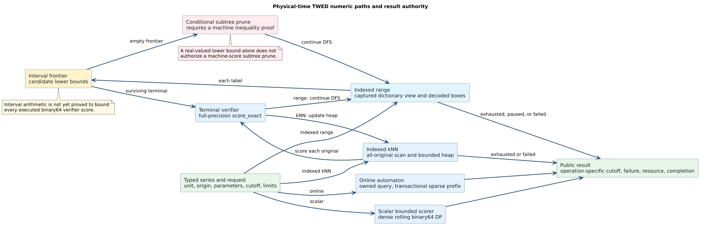

# Physical-time TWED: source operations and numeric proof obligations

**Campaign:** `metric-automata-cbc-theory`, preparatory artifact for `cbc-06-twed-graph`.
**Status:** source map, not a proved Rust correspondence. This map covers the
current scalar bounded scorer, fixed-query online automaton, indexed range
product, and the index's full-scan kNN path. It does not authorize production
pruning or claim that binary64 TWED is a metric. The
[source metric contract](twed-metric-source-contract.md) states the separate
ideal-real theorem boundary.

## 1. Terms and numeric trace language

Let $`q`$ be the fixed query, $`c`$ one candidate, $`o`$ their common physical
origin, $`\nu>0`$ the stiffness, $`\lambda\ge0`$ the gap penalty, and $`T`$ an
inclusive distance cutoff. A point has a scalar value and a timestamp in a
specified `TimestampUnit`. Index zero is the sentinel $`(0,o)`$; positive
indices identify stored samples. $`D(i,j)`$ denotes the score after the first
$`i`$ query samples and first $`j`$ candidate samples. `TOP` is positive binary64
infinity. A **search snapshot** is the captured indexed view used by a range
continuation, not an extra field in the standalone online automaton.

The proposed numeric intermediate representation (numeric IR) must record an
ordered trace of these *typed* operations for each source path:

| IR event | Required meaning |
|---|---|
| `validate(field, predicate, error)` | Named input check, its position relative to other checks, and its error tag. |
| `sub`, `abs`, `mul`, `add` | One binary64 primitive with operands, order, rounding mode, intermediate value, and nonfinite classification. Source `+` and `WeightedCost::combine` have different guards at `TOP` and need separate nodes. |
| `min(left,right)` | The executed `f64::min` with its argument order and NaN/signed-zero behavior. A mathematical minimum is an abstraction requiring a transfer proof. |
| `within(score,T)` | The executed numeric `<=` comparison. Finiteness and nonnegativity guards are separate and path specific; an inclusive cutoff is not the result order's `total_cmp`. |
| `tag(reason)` | `Err`, `Complete(WithinCutoff)`, `Complete(AboveCutoff)`, or `Incomplete(reason, partial, continuation)` at the exact source branch. |
| `retain/charge/commit` | Stored DP cell, resource-ledger change, or public-prefix commit. These are trace events, not score arithmetic. |

`N-R` means the ideal real recurrence, `N-F` the specified binary64 operation
graph, and `N-E` a directed enclosure of an ideal value. The present Rust
interval code computes binary64 *candidate lower bounds*; it has not yet been
proved to implement an `N-E` enclosure or an `N-F` bound for every accepted
input. `N-I` applies to checked integer lengths, capacities, and work counts.
The [numeric authority ledger](../verification/CBC_NUMERIC_AUTHORITY.md)
describes these profiles more generally.

The diagram [source](../diagrams/architectures/twed-numeric-operation-paths.puml)
keeps interval bounds separate from exact score paths and marks subtree
pruning as conditional on a machine inequality.

## 2. Shared admission and local costs

The table records source order; each row is a separate numeric-IR obligation.
Source links point to the actual primitive or caller. The
[scalar scorer](../../src/time_series/timestamped_twed.rs) and
[online machine](../../src/time_series/automaton/timestamped_twed.rs) share
`delete_cost` and `match_cost`, while the indexed product additionally calls
interval relaxations.

| ID | Source operation in execution order | Required correspondence |
|---|---|---|
| A1 | [`TimestampedSeries::try_new_with_origin`](../../src/time_series/timestamped_twed.rs#L179) checks equal array lengths, nonempty input, the series-length ceiling and then finite scalar values through `ResourceLedger`, finite origin/times, first time `>= origin`, successive times strictly increasing, then checked storage and allocation. | Retain validation and error precedence. The raw first time **may equal** the origin; the strict wrapper tests `>` separately. |
| A2 | [`MetricTimestampedTwedConfig::try_new`](../../src/time_series/timestamped_twed.rs#L344) admits finite `nu > 0` and finite `lambda >= 0`. | Bind the same parameters for both operands, local bounds, exact verification, and any metric theorem. A floating comparison is not a proof of ideal positivity after later arithmetic. |
| A3 | [`delete_cost`](../../src/time_series/timestamped_twed.rs#L702) evaluates `abs(value-previous_value)`, then `nu * (time-previous_time)`, then `WeightedCost::combine(value_term,time_term)`, then `WeightedCost::combine(previous_sum,lambda)`. | Preserve both subtraction orders, each rounding, two guarded combines, the sentinel predecessor `(0,o)` at the first sample, and lambda on **every** boundary or interior deletion. `WeightedCost::combine` absorbs positive infinity before otherwise using `+`. |
| A4 | [`match_cost`](../../src/time_series/timestamped_twed.rs#L719) computes current scalar absolute difference, predecessor scalar absolute difference, their `WeightedCost::combine`, two timestamp subtractions and absolute values, their raw `+`, multiplication by `nu`, then final `WeightedCost::combine`. | Preserve predecessor identity and the `nu * (delta_current + delta_previous)` grouping. A match has no lambda. |
| A5 | [`TimestampedScalarBox`](../../src/time_series/timestamped_twed.rs#L91) accepts ordered NaN-free value intervals, possibly with infinite endpoints, but finite ordered time intervals; unit tags must agree. `interval_gap` and `point_interval_distance` branch on ordered endpoints. | Prove every decoded label contains its original point in the **executed** binary64 comparison model, including signed zero, infinite value endpoints, and extreme quantizer bins. |
| A6 | [`interval_delete_lower_bound`](../../src/time_series/timestamped_twed.rs#L386) uses value-interval gap, time-interval gap, `nu * elapsed`, two `WeightedCost::combine` calls, including lambda. | Prove its machine value is no greater than each concrete `delete_cost` for points in the two boxes under the same `N-F` authority, or use a certified enclosure and transfer. Interval gaps are nondirectional; monotone timestamps supply the directed concrete time premise. |
| A7 | [`interval_match_lower_bound`](../../src/time_series/timestamped_twed.rs#L405) checks unit, finite query values/times, and `query_current_time > query_previous_time`; it adds two point-to-interval value gaps, adds two time gaps, multiplies by `nu`, then combines the two groups. | Prove local `N-F` admissibility and source validation correspondence. At the first query point this strict guard rejects raw series whose first time equals origin, although A1 admits them. The caller maps its error to `InvalidStoredData`; the indexed range contract must resolve that mismatch explicitly. |

## 3. Dense scalar and online operations

### 3.1 Bounded scalar verifier

[`distance_bounded`](../../src/time_series/timestamped_twed.rs#L451) is the
public scalar tag boundary. Its private
[`timestamped_distance_with_cutoff`](../../src/time_series/timestamped_twed.rs#L580)
is a dense two-column recurrence with a cutoff shortcut.

| ID | Ordered source operation | Numeric-IR and proof obligation |
|---|---|---|
| S1 | Reject mixed unit, then unequal origins by numeric `!=`, then NaN or negative cutoff; validate both lengths. Checked `cells`, `work`, and two-column scratch counts precede the atomic ledger charge; any one of those count overflows is currently tagged `Incomplete(ArithmeticOverflow(DpCells))`. Charge failure also returns `Incomplete`. | Preserve first-error order and distinguish the scalar origin equality from the index's bitwise origin identity. Record the initial budget ledger and all checked `N-I` sizes, including the combined overflow tag. |
| S2 | Swap left/right if `right.len() > left.len()` to put the shorter operand on the column axis; reserve and fill two vectors with `TOP`; set `D(0,0)=0`. | Prove the transposition uses TWED symmetry under the *same executed operation graph* or a tag-preserving relation, including predecessor terms and cutoff. Memory is two vectors of width `min(lengths)+1`. |
| S3 | For each shorter-axis sample, carry prior value/time from sentinel `(0,origin)`; set `D(0,j)=combine(D(0,j-1),delete_cost(...))`. | Every boundary step includes lambda and uses the previous physical timestamp. This loop does not itself reject nonfinite cells; track how `TOP` reaches later `min` and final tag logic. |
| S4 | For each longer-axis sample, compute `left_delete` once; set `D(i,0)=combine(D(i-1,0),left_delete)` and seed `row_min`. | Bind both the cached local deletion and the boundary addition to A3. |
| S5 | In each interior cell, compute `pair=combine(D(i-1,j-1),match_cost)`, `delete_left=combine(D(i-1,j),left_delete)`, `delete_right=combine(D(i,j-1),delete_cost)`, then `pair.min(delete_left).min(delete_right)`. | Preserve cell dependency, predecessor pair, local operation order, `TOP` absorption, and min order; show scalar recurrence correspondence for every retained cell. |
| S6 | Update `row_min` with each cell. If `!WeightedCost::within(row_min,T)`, return `Ok(None)` before swapping generations. Otherwise swap vectors, advance predecessor values/times, and continue. | Prove all future extensions of an excluded row remain outside the inclusive cutoff in `N-F`; `within` is numeric `<=` and treats NaN as false. The shortcut may change failure tags when an unchecked intermediate overflows. |
| S7 | Final `within(D(m,n),T)` returns `Some(score)` or `None`. Public mapping returns `Complete(WithinCutoff)` only for finite `Some`; for finite cutoff, other successful scorer outcomes become `Complete(AboveCutoff)`; an unbounded cutoff with no finite score becomes `Incomplete(NumericOverflow)`. | Prove completed tags only under a path-specific result contract. Do not identify `AboveCutoff` with structural impossibility or numeric overflow without a machine transfer. Resource failures remain distinct `Incomplete` outcomes. |

### 3.2 Fixed-query online automaton

[`TimestampedTwedOnlineAutomaton`](../../src/time_series/automaton/timestamped_twed.rs#L32)
owns its query and configuration; there is no dictionary snapshot to capture.
It accepts only a finite nonnegative cutoff, unlike the scalar method's
positive-infinity cutoff policy.

| ID | Ordered source operation | Numeric-IR and proof obligation |
|---|---|---|
| O1 | Constructor checks target unit, finite target origin, equal numeric origin, finite nonnegative cutoff, query length/frontier/scratch ceilings, then fallible reservations. It seeds query-axis `D(i,0)` by A3 and `combine`, replacing a value failing `valid_within` by `TOP`. | Model each constructor `Err`, N-I failure, and the initial cutoff truncation. Prove truncated states cannot later lead to a within-cutoff completed prefix under admitted nonnegative costs. |
| O2 | `observation()` exposes consumed prefix length, active count, last-row distance only after at least one target sample and `valid_within`, and minimum active cost by `f64::total_cmp`; zero is canonicalized. | Separate exact prefix-score, active-set, and total-order diagnostics; `None` before any target sample is an API observation, not an empty-series distance theorem. |
| O3 | `advance` validates finite value, finite time, strictly increasing time after the first target point, and first time `>= target_origin`; checked depth and per-step work follow. | Validation failures leave the committed prefix unchanged. Raw origin equality is admitted here too; the metric pullback's strict domain is narrower. |
| O4 | If the active set is empty, a positive work allowance commits the point and depth with one work unit; zero allowance returns `Incomplete`. | Prove the empty frontier is permanently unable to re-enter below the fixed cutoff. Preserve the committed-prefix and usage observations. |
| O5 | Otherwise clear only previously staged next rows, take prior target `(value,time)` or sentinel, compute A3 target deletion, and enumerate `NeighborSeedRows` of active query rows. Charge one work unit before each evaluated row. | Prove sparse scheduling covers every row that could become active; staged writes remain private until success. A failed work charge returns `Incomplete` and clears staging. |
| O6 | Row zero uses `combine(current[0],target_delete)`. Positive rows fetch query predecessor or sentinel, compute A3 query deletion and A4 match, then `pair.min(delete_query).min(delete_target)`. | Simulate the dense S3–S5 column after cutoff truncation; account for `WeightedCost::combine` and min order. |
| O7 | A NaN, negative cost, or negative infinity returns `Incomplete(NumericOverflow)`; `valid_within` retains only finite, nonnegative cells `<= T`, canonicalizes zero, and schedules the next vertical row. | Show pruning and overflow behavior relative to the chosen finite-cutoff profile. An over-cutoff finite or positive-infinite cost simply becomes inactive, so no unconditional scalar-tag equivalence follows. |
| O8 | Only after all rows succeed, swap current/next columns and active vectors, commit previous target and depth, then return `Advanced` with O2 observation and per-step usage. Failure clears private staging and returns `Incomplete` without consuming a point. | Prove transactional rollback, no leaked active cell, and the precise resource trace; a page or resource error is not a completed score. |

## 4. Indexed interval product and its exact branch

The [typed quantizer and index](../../src/time_series/timestamped_twed_index.rs)
store every original full-precision `TimestampedSeries` in a terminal bucket.
The optimized path is resumable **range** search; the index's **kNN** path is
a full-precision scan. Both use the private `score_exact`, whose binary64 DP
additions and failure policy differ from the scalar `distance_bounded` path.

| ID | Ordered source operation | Numeric-IR and proof obligation |
|---|---|---|
| R1 | Quantizer constructor fixes unit/origin, finite positive-width value/time domains, time-domain start `>= origin`, and bin counts. `encode` checks each finite point is in domain and packs unit/value/time; insertion retains the complete original in its collision bucket. | Prove token identity and one-to-one enumeration of originals despite quantization collisions; unit and origin remain fixed for the index. |
| R2 | [`bin_index`/`bin_interval`](../../src/time_series/timestamped_twed_index.rs#L2130) use rounded subtraction, division, multiplication, floor, cast, and one-step `next_down`/`next_up` widening. `decode` validates token unit and bin ranges. | Prove each encoded point is enclosed by its decoded box under the *whole* binary64 quantizer graph. One ULP of widening is not self-certifying. Decode failure is `InvalidStoredData` during traversal. |
| R3 | [`search_range_bounded`](../../src/time_series/timestamped_twed_index.rs#L387) checks query unit and **bitwise** origin against the index, then query length and NaN/negative cutoff. Start failures return `Incomplete`, not complete absence. | Bind request to one index configuration and preserve error precedence. The index distinguishes positive from negative zero origin bits even though S1's numeric equality accepts them. This surface admits raw origin-equal queries, while A7's interval match rejects them on the first positive row. |
| R4 | [`start`](../../src/time_series/timestamped_twed_index.rs#L1026) checks state/width/scratch limits, accumulates the entire query-only boundary by raw `+= delete_cost`, rejects nonfinite sums, and caps `root_final_cost` above cutoff to `TOP`. It interns root `(row=0,cost=0)`, captures dictionary root/term count, opens DFS, charges root and allocates exact buffers. | Model the **lambda-inclusive** boundary, its raw `+` order, cutoff capping, and all startup errors. The captured traversal owner fixes the logical revision across pages. |
| R5 | A terminal bucket enumerates every retained original; page result/work limits and cumulative candidate/cell/work charges precede `score_exact`. The next-candidate cursor advances only after a successful exact decision. Verified matches are appended only after result reservation and charge. | Prove no duplicate or missing original, cursor/private ownership on pause, exact partial semantics, and failure precedence. A stored series with excessive length returns `Incomplete`. |
| R6 | Each nonterminal edge is page-budgeted and ledger-charged, then [`transition`](../../src/time_series/timestamped_twed_index.rs#L1471) probes its optional `(state,token)` cache. On a miss it decodes current and previous boxes, or uses a singleton sentinel box, reconstructs the source frontier, and computes A6 candidate deletion. | Prove cache hits replay the same result under identical state/token/query/snapshot/parameters; hash/fingerprint equality is only a lookup hint. Nonfinite candidate deletion gives `Incomplete(NumericOverflow)`. |
| R7 | [`reconstruct_frontier`](../../src/time_series/timestamped_twed_index.rs#L1845) replays omitted same-column query deletions with **raw `+`** A3, stopping at cutoff; it checks increasing rows, finite costs, and a canonical-bitwise final-row match. `build_scheduled_rows` adds each active row and successor. | Prove compressed residual reconstruction is bit-identical to the full `N-F` interval column, and the schedule contains every possible successor. An invalid residual is tagged `InvalidStoredData`. |
| R8 | [`step_sparse_interval_frontier`](../../src/time_series/timestamped_twed_index.rs#L1962) merges scheduled and vertical rows. Row zero uses `frontier_cost(0)+candidate_delete`; positive rows use prior query point/sentinel, `frontier_cost(row-1)+A7 match`, prior output row plus A3 query deletion, and `frontier_cost(row)+candidate_delete`, followed by `pair.min(delete_query).min(delete_candidate)`. | Preserve every raw addition, three-way min order, predecessor box, and `TOP` for missing rows. A7 errors map to `InvalidStoredData`; NaN is `NumericOverflow`; finite costs `<= cutoff` survive without a separate `>= 0` guard, so nonnegativity must be proved for admitted operations. |
| R9 | A surviving row schedules the next vertical row; an empty next frontier returns `None` and prunes the entire child subtree. [`canonicalize_frontier`](../../src/time_series/timestamped_twed_index.rs#L2073) omits a vertical row only when `canonical_bits(previous.cost + query_delete) == canonical_bits(current.cost)`. | Prove lower-bound admissibility against every original in that subtree, including equality at cutoff; prove the bitwise vertical omission can be reconstructed and remains future-equivalent. Merely equal real values or a hash collision do not suffice. |
| R10 | The new state's previous token, canonical positions and final-row cost are interned with fingerprint lookup followed by exact row/bit comparisons; the optional transition cache may decline storage. A surviving child becomes a DFS frame. | Prove state equality implies identical future transitions and final decisions, and either cache hit or miss preserves semantics. State/position/queue/storage limit failures remain `Incomplete`. |
| R11 | [`score_exact`](../../src/time_series/timestamped_twed_index.rs#L1568) fills both vectors with infinity and initializes the entire query-only boundary by raw `+` A3. Each candidate point computes A3 candidate deletion, its boundary cell, then each positive row's raw `+` A4 match, raw `+` A3 query deletion, and raw `+` candidate deletion; it uses `pair.min(delete_query).min(delete_candidate)`. | This is the full-precision **candidate verifier**. Prove its own recurrence and numeric authority; do not silently substitute the scalar scorer's guarded `combine` graph. |
| R12 | `score_exact` rejects a nonfinite interior or final cell with `Incomplete(NumericOverflow)`, returns `None` if column minimum `> cutoff`, and finally returns `Some(score)` only if `score <= cutoff`. Range emits only a `Some` original and sorts completed results by `(distance.total_cmp, episode_id)`. | Prove the column-minimum shortcut, cutoff equality, score/tag mapping, and stable identity/tie order. Nonfinite handling can differ from S6–S7 at a finite cutoff; a common result theorem needs a transfer or explicit profile. |
| R13 | `resume` returns `Complete` only after stack exhaustion. A page pause keeps the continuation and `partial=None`; cancellation or terminal failure returns an exact sorted partial with no continuation. | Model snapshot ownership, page/work/result limits, terminal reasons, and incomplete partials separately from completed membership. The result vector alone is never a completeness certificate. |
| K1 | [`search_knn_bounded`](../../src/time_series/timestamped_twed_index.rs#L420) validates the query, handles `k=0`/empty index after validation, charges result capacity, reserves two query-width buffers and a size-`k` heap, then scans all bucket originals. Checked scratch-width/byte overflow returns `Err(IndexError::Resource)`; peak and allocation failures return `Incomplete`. | This is the **reference full-scan branch** for indexed kNN; it has no interval pruning. Prove validation before the zero-result shortcut, the distinct setup tags, and checked work/cell/candidate charging. |
| K2 | Each candidate is scored by R11–R12 with cutoff equal to infinity until the heap fills, then the worst retained distance. Heap comparison and final sorting use `(distance.total_cmp, episode_id)`; failure exposes a sorted verified partial, never final top-`k`. | Prove all-original coverage, exact-score tags, inclusive worst-distance equality for smaller tie keys, heap replacement, and incomplete-result semantics. The runtime `score_exact` source graph remains distinct from S3–S7. |

## 5. Named proof obligations and counterexamples

The operation IDs above are inputs to later machine-checked obligations. A
proof may discharge several IDs, but each theorem must state its path,
snapshot, query, parameters, numeric profile, cutoff policy, and observation
profile. No theorem here is asserted as already proved.

| Obligation | Required result |
|---|---|
| `TWED-NIR-ADMIT` | A1–A2, O1/O3, R1/R3 and K1 identify the same admitted request where equivalence is claimed; otherwise relate explicit `Err`/`Incomplete` tags. Resolve the origin-equal query mismatch at A7/R8. |
| `TWED-NIR-LOCAL` | A3–A4 match a specified ideal recurrence under a validated `N-F` graph; preserve each primitive and overflow state. Keep the product-sample metric and strict-origin sequence-metric claims separate within ideal `N-R`. |
| `TWED-NIR-SCALAR` | S2–S6 establish dense recurrence, symmetry of the shorter-axis swap, lambda-inclusive axes, and cutoff-pruning safety; S1/S7 establish public result tags. |
| `TWED-NIR-ONLINE` | O1–O8 simulate committed scalar prefixes with the finite-cutoff profile, sparse neighbor scheduling, rollback, and exact resource observations. |
| `TWED-NIR-ENCLOSE` | R1–R2 establish conservative decoded boxes for all admitted originals, including rounded bin arithmetic and token/unit identity. |
| `TWED-NIR-BOUND` | A5–A7 and R6–R9 establish a machine inequality from each interval cell to each original exact cell under the selected verifier authority. A real-only K1 inequality cannot authorize a binary64 subtree prune. |
| `TWED-NIR-SPARSE` | R7–R10 establish schedule completeness, bitwise reconstruction, safe vertical omission, exact state equality after fingerprint lookup, and cache transparency. |
| `TWED-NIR-VERIFY` | R11–R12 establish the full-precision verifier's exact score/tag contract, its column-minimum cutoff rule, and any required relation to S3–S7 despite raw `+` versus guarded `combine`. |
| `TWED-NIR-SESSION` | R3–R5/R13 establish one captured revision, exact terminal/collision coverage, cursor ownership, page/result budgets, and complete versus incomplete outcomes. |
| `TWED-NIR-KNN` | K1–K2 establish all-original scanning, candidate eligibility, canonical `(total_cmp,episode_id)` top-`k`, and partial-heap limitations. |

**Boundary-lambda control.** With sentinel $`(0,0)`$, one point $`(0,1)`$,
$`\nu=1`$, and $`\lambda=3`$, A3 gives the first one-empty cell cost $`4`$. An
incorrect boundary that omits $`\lambda`$ gives $`1`$. At cutoff $`2`$, O1's initial
active set and R4's root final cost differ. This is an internal boundary-cell
control: the current raw scalar series constructor requires nonempty operands,
so it is not a claim that the scalar public API accepts an empty series.
The [2008 printed-boundary counterexample](twed-metric-source-contract.md#the-2008-printed-boundary-loses-triangle-for-positive-gap-penalty)
separately shows why that published boundary cannot replace this one.

**Reordered-arithmetic control.** Let a valid first sample have value $`2^{53}`$,
time $`1`$, origin $`0`$, $`\nu=1`$, and $`\lambda=1`$. A3's executed grouping is
$`\operatorname{fl}(\operatorname{fl}(2^{53}+1)+1)=2^{53}`$ in round-to-nearest-even
binary64; regrouping as $`\operatorname{fl}(2^{53}+\operatorname{fl}(1+1))`$
gives $`2^{53}+2`$. A cutoff of exactly $`2^{53}`$ can therefore distinguish
them. The same warning applies to A4's timestamp sum before multiplication
and to the proof-only anchor shift: at $`t=o=2^{53}`$,
$`\operatorname{fl}(\operatorname{fl}(1+t)-o)=0`$ while
$`\operatorname{fl}(1+\operatorname{fl}(t-o))=1`$. An ideal-real shift equality does
not license either machine rewrite. The [weighted carrier](../../src/cost/weighted.rs#L21)
uses guarded binary64 addition and `total_cmp`; its algebraic real laws do
not establish bitwise associativity.

**Origin-equality tag control.** A raw one-point query $`[(0,0)]`$ with origin
$`0`$, $`\nu=1`$, $`\lambda=0`$, and cutoff $`0`$ passes A1 and R3. With a
stored episode at the same point, a quantizer time domain $`[0,1]`$, and
page/work/result/resource budgets sufficient to process the first edge, the first
edge's row-zero interval cost survives; R8 then asks A7 to compare the query
first time against its origin and maps its nonmonotone error to
`InvalidStoredData`.
The scalar path still admits the query. A common scalar/indexed-range contract
must either narrow indexed admission to strict-origin queries with an explicit
validation tag, or prove and implement a sound relaxed first-step interval
rule. This map records the current divergence; it does not choose a runtime
change.

## 6. Scope of this draft

The [anchor-transfer Rocq file](../verification/twed/theories/Metric/TimestampedMetricTransfer.v)
proves ideal-real charge shift and an abstract forced-anchor recurrence, with
source sequence-metric and recurrence-score premises still open. It neither
models the operations listed here nor proves the binary64, interval, indexed
session, or Rust tag obligations. This draft supplies named source sites and
control scenarios for those future proofs. No experiment or production
optimization was executed to produce it.
