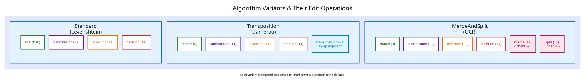

# Universal merge/split variant: Phase 3 completion record

**Recorded:** 2025-11-13 · **Status:** implemented · **Document type:**
historical completion snapshot with current integration notes

Phase 3 added the compile-time `MergeAndSplit` position variant to
`UniversalAutomaton`. The implementation is additive: it retains match,
substitution, insertion, and deletion transitions and adds one-cost merge and
split transitions.



This report explains the offset derivation and the reason for the transient
split state. It no longer serves as an implementation plan. For the shipped
runtime-configurable system, see the
[generalized operation-set design](../design/generalized-operations.md).

## 1. Vocabulary and orientation

`UniversalAutomaton::accepts(word, input)` treats `word` as the dictionary
source and streams `input` as the target. In this report, the universal variant
uses the source-to-target names:

| Universal operation | Source scalars | Target scalars | Cost | Execution shape |
|---|---:|---:|---:|---|
| merge | 2 | 1 | 1 | Direct transition |
| split | 1 | 2 | 1 | Entry and completion transitions |

The `OperationSetBuilder` method names follow an older query-to-dictionary
vocabulary. Consequently `with_merge()` constructs arity `(1,2)` and
`with_split()` constructs `(2,1)`. `OperationSet::with_merge_split()` contains
both, so the combined relation agrees with this universal variant even though
the individual names are reversed by orientation. Numeric arities are the
unambiguous comparison key.

Let `$`k`$` be the number of target scalars already streamed, `$`i`$` the
absolute source position, and `$`\delta`$` the stored universal offset:

```math
i=\delta+k.
```

The variant state is either:

- `MergeSplitState::Usual`, for an ordinary position; or
- `MergeSplitState::Splitting`, after the first target scalar of a split has
  been consumed and before the second completes the operation.

Both I-type and M-type positions dispatch through the same variant policy.

## 2. Offset derivation

The offset updates follow from the invariant `$`i=\delta+k`$`; they are not
independent heuristics.

### 2.1 Direct merge

A merge consumes two source scalars while the streaming machine consumes one
target scalar. From source position `$`i`$`, the destination is `$`i+2`$` at
stream position `$`k+1`$`. Therefore:

```math
\delta' + (k+1)
= i+2
= \delta+k+2,
\qquad
\delta'=\delta+1.
```

The implementation emits a usual-state successor with offset `$`\delta+1`$`
and one additional error when the next relevant source position matches the
streamed target scalar.

### 2.2 Split entry

A split maps one source scalar to two streamed target scalars. After the first
target scalar, the source position remains `$`i`$` while the stream position
becomes `$`k+1`$`:

```math
\delta' + (k+1)
= i
= \delta+k,
\qquad
\delta'=\delta-1.
```

The successor enters `Splitting` with offset `$`\delta-1`$`. The transient
state records that the one-cost operation has started; it prevents this first
half from being mistaken for an independently accepting edit.

### 2.3 Split completion

When the second target scalar completes the split, the source advances from
`$`i`$` to `$`i+1`$` while the stream again advances by one:

```math
\delta' + (k+1)
= i+1
= \delta+k+1,
\qquad
\delta'=\delta.
```

The implementation returns to `Usual` at the same offset. It increments the
stored error field on entry and removes that transient increment on completion,
matching the special-position representation. Acceptance depends on the final
source displacement as well as the error field, so the split's cost cannot be
inferred from the field change in isolation.

The three shipped updates are therefore:

| Transition | State change | Offset change |
|---|---|---:|
| merge | `Usual -> Usual` | `+1` |
| split entry | `Usual -> Splitting` | `-1` |
| split completion | `Splitting -> Usual` | `0` |

For comparison, the transposition variant also enters a transient state with
offset `-1`, but completes with offset `+1` because it advances two source
positions.

## 3. Successor construction

`MergeAndSplit::compute_i_successors` and
`MergeAndSplit::compute_m_successors` follow the same complete flow:

1. generate all ordinary standard-operation successors;
2. derive bounded characteristic-vector indices for the current and next
   source positions;
3. if the state is `Splitting`, attempt only the split-completion transition;
4. otherwise, attempt a direct merge and a split entry when error budget and
   match predicates allow them; and
5. construct successors through the checked universal-position constructors.

Starting with the standard successor set is what makes merge/split additive.
Selecting `MergeAndSplit` does not disable substitution, insertion, or
deletion.

The split state is semantically necessary because the universal automaton
streams one target scalar per transition. A source-to-target `(1,2)` edge
cannot be observed atomically in that interface. The exact
`GeneralizedAutomaton` grid does not need this intermediate vocabulary because
it advances both alignment coordinates by an operation's complete declared
arity in one edge.

## 4. Cross-validation performed in Phase 3

The phase compared the universal transitions with the then-existing lazy
position implementation:

| Behavior | Lazy position effect | Universal offset effect |
|---|---|---|
| merge | advance source by two and charge one edit | `+1`, charge one edit |
| split entry | retain source position and enter special state | `-1`, enter `Splitting` |
| split completion | advance source by one and leave special state | `0`, return to `Usual` |

The comparison checked start, middle, and end positions; repeated characters;
empty and singleton boundaries; combinations with standard edits; and two-edit
sequences containing multiple merges or splits.

## 5. Historical test snapshot

At the recorded Phase 3 checkpoint, all 630 tests in that repository snapshot
passed. The count is historical and must not be read as the current
repository-wide test total. The 13 dedicated cases were:

1. `test_merge_and_split_distance_zero`;
2. `test_merge_simple`;
3. `test_split_simple`;
4. `test_merge_and_split_longer_words`;
5. `test_merge_and_split_with_standard_operations`;
6. `test_merge_and_split_empty_and_single_char`;
7. `test_merge_at_start`;
8. `test_merge_at_end`;
9. `test_split_at_start`;
10. `test_split_at_end`;
11. `test_merge_and_split_multiple_operations`;
12. `test_merge_and_split_vs_standard`; and
13. `test_merge_and_split_with_repeated_chars`.

The implementation remains in
`src/transducer/universal/position.rs`, and its executable examples remain in
the universal-automaton test module. This document intentionally avoids copied
partial Rust bodies so the source remains the sole executable definition.

## 6. Current integration boundary

The runtime integration formerly listed as “GeneralizedAutomaton Phase 2d” has
shipped. The two surfaces now have complementary roles:

1. `UniversalAutomaton<MergeAndSplit>` retains the compile-time-specialized
   transient-state implementation described above.
2. `OperationSet::with_merge_split()` exposes standard operations plus both
   unrestricted arities `(1,2)` and `(2,1)` as runtime data.
3. `GeneralizedAutomaton::try_with_operations` validates and executes that
   runtime grammar on the exact sparse operation grid.

There is no pending integration step that must fold arbitrary runtime rules
into the universal position representation. Keeping the fixed universal
variant separate from the operation-complete evaluator prevents arbitrary
arities from being approximated by a compile-time intermediate-state
vocabulary.

For the exact runtime recurrence, resource ceiling, and verification map, see
the [generalized-automaton repair](../design/generalized-automaton-repair.md)
and the
[literate generalized-grid algorithm](../algorithms/14-generalized-operation-grid/README.md).

## 7. Reference

The universal-position construction and generalized operation vocabulary are
related to P. Mitankin, S. Mihov, and K. U. Schulz, “Deciding word neighborhood
with universal neighborhood automata,” *Theoretical Computer Science* 412(22),
2340–2355 (2011),
[DOI 10.1016/j.tcs.2011.01.013](https://doi.org/10.1016/j.tcs.2011.01.013).
