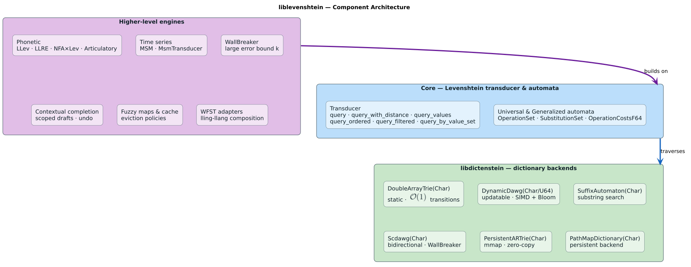

# Feature Documentation

**Version**: 0.9.1
**Last Updated**: 2026-06-19

This document describes all features available in liblevenshtein-rust.

The diagram below shows how the major components stack: the dictionary backends (now
provided by the **[libdictenstein](https://crates.io/crates/libdictenstein)** crate) sit
beneath the Levenshtein automata, intersection traversal, and query-iterator layers.



## Core Features

### 1. Dictionary Implementations

The dictionary data structures live in the **[libdictenstein](https://crates.io/crates/libdictenstein)**
crate and are re-exported by liblevenshtein. The `*Char` variants are the UTF-8
(`char`/`u32`) counterparts of the byte-level (`u8`) backends. The full set is:

| Backend | Unit | Mutable | Best for |
|---------|------|---------|----------|
| `DoubleArrayTrie` / `DoubleArrayTrieChar` | `u8` / `char` | No (read-only) | Static dictionaries, fastest reads (**default**) |
| `DynamicDawg` / `DynamicDawgChar` | `u8` / `char` | Yes | Runtime insert/delete with space efficiency |
| `DynamicDawgU64` | `u64` | Yes | Token/ID streams keyed by 64-bit units |
| `SuffixAutomaton` / `SuffixAutomatonChar` | `u8` / `char` | No | Substring search |
| `Scdawg` / `ScdawgChar` | `u8` / `char` | No | Compacted DAWG with shared suffixes |
| `PersistentARTrie` / `PersistentARTrieChar` | `u8` / `char` | Persistent | Lock-free snapshots via structural sharing |
| `PathMapDictionary` | `u8` | Yes | General-purpose trie with structural sharing |

See the [Backends guide](backends.md) for a full comparison and decision tree.

#### DoubleArrayTrie (Default Choice)
- **Type**: Double-array trie, optimized for fast reads
- **Best for**: Static dictionaries that are built once and queried many times
- **Mutability**: Treat as read-only once constructed
- **Usage**:
```rust
use liblevenshtein::prelude::*;

let dict = DoubleArrayTrie::from_terms(vec!["test", "testing"]);
```

#### DynamicDawg
- **Type**: DAWG with online insert/delete/minimize operations
- **Best for**: Dictionaries needing both space efficiency and runtime updates
- **Thread-safe**: **Lock-free** reads (`LockFreeDawg` core); writes via `compare_exchange`
- **Space efficiency**: Maintains DAWG properties through incremental minimization
- **Usage**:
```rust
use liblevenshtein::prelude::*;

let dict = DynamicDawg::from_terms(vec!["test", "testing"]);
dict.insert("tester");  // Online insertion with minimization
dict.remove("test");    // Online deletion
```

#### PathMapDictionary
- **Type**: Trie-based using structural sharing
- **Best for**: General-purpose, dynamic modifications
- **Thread-safe**: **Lock-free** reads (`Arc<ArcSwap<…>>`); writes publish by atomic swap
- **Usage**:
```rust
use liblevenshtein::prelude::*;

let dict = PathMapDictionary::from_iter(vec!["test", "testing"]);
```

### 2. Levenshtein Algorithms

#### Standard Levenshtein
- Operations: Insert, Delete, Substitute
- Use case: General string matching

#### Transposition
- Operations: Standard + Transposition
- Use case: Typos involving swapped characters

#### Merge and Split
- Operations: Standard + Merge + Split
- Use case: OCR errors, concatenation/separation issues

### 3. Transducer Builder Pattern

Fluent API for creating transducers with validation:

```rust
use liblevenshtein::prelude::*;

let transducer = TransducerBuilder::new()
    .dictionary(dict)
    .algorithm(Algorithm::Transposition)
    .build()?;
```

**Benefits**:
- Clear, readable configuration
- Compile-time type checking
- Helpful error messages
- Order-independent method calls

### 4. Query Iterators

#### Standard Query Iterator
- Returns results in discovery order
- Lazy evaluation, no collection overhead
```rust
for term in transducer.query("test", 2) {
    println!("{}", term);
}

for candidate in transducer.query_with_distance("test", 2) {
    println!("{}: {}", candidate.term, candidate.distance);
}
```

#### Ordered Query Iterator (v0.4.0)
- **Distance-first ordering**: Results sorted by edit distance, then lexicographically
- **Perfect for code completion**: Most relevant results first
- **Usage**:
```rust
for candidate in transducer.query_ordered("aple", 1) {
    println!("{}: {}", candidate.term, candidate.distance);
}
// Output:
//   ape: 1
//   apple: 1
//   apply: 1
```

#### Filtering and Prefix Matching (v0.4.0)
- **Custom filters**: Apply arbitrary predicates to results
- **Prefix mode**: Match only terms starting with query $`\pm`$ edits
- **Optimized**: Bitmap masking for efficient context filtering
- **Usage**:
```rust
// Prefix matching for code completion
for candidate in transducer
    .query_ordered("getVal", 1)
    .prefix()  // Only terms starting with "getVal" ± 1 edit
    .filter(|c| c.term.starts_with("get"))
{
    println!("{}: {}", candidate.term, candidate.distance);
}
```

See the [Code Completion Guide](code-completion.md) for detailed examples.

## Optional Features

### Dictionary Serialization

Enable with: `features = ["serialization"]`

**Supported formats**:
- **Bincode**: Fast, compact binary format
- **Protobuf** (optional `protobuf` feature): Portable binary schema
- JSON, TOML, and newline text are deliberately not persistence formats

**Compression support** (v0.2.0, optional `compression` feature):
- **Gzip compression**: Corpus-dependent size reduction with added CPU/latency
- **Compressed formats**: bincode-gz and protobuf-gz
- **Generic wrapper**: `GzipSerializer<S>` wraps a supported binary serializer

**Usage**:
```rust
use liblevenshtein::prelude::*;
use liblevenshtein::serialization::*;
use std::fs::File;

// Save dictionary with compression
let dict = PathMapDictionary::from_iter(vec!["test", "testing"]);
let file = File::create("dict.bin.gz")?;
GzipSerializer::<BincodeSerializer>::serialize(&dict, file)?;

// Load compressed dictionary
let file = File::open("dict.bin.gz")?;
let loaded: PathMapDictionary = GzipSerializer::<BincodeSerializer>::deserialize(file)?;

// Protobuf format (cross-language)
#[cfg(feature = "protobuf")]
{
    let file = File::create("dict.pb.gz")?;
    GzipSerializer::<ProtobufSerializer>::serialize(&dict, file)?;
}
```

**Benefits**:
- **Fast startup** with pre-built dictionaries
- **Share dictionaries** across systems and languages
- **Trade CPU for storage or transfer size** when representative benchmarks justify gzip
- **Production-ready**: Validated with 470k+ word dictionaries

### CLI Tool

Enable with: `features = ["cli"]`

Build: `cargo build --bin liblevenshtein --features cli,compression,protobuf --release`

**Commands**:

1. **Query**: Search for fuzzy matches
```bash
liblevenshtein --query --text aple \\
    --dict words.bin \\
    --max-distance 2 \\
    --algorithm transposition \\
    --show-distances
```

2. **Convert**: Between supported binary formats and backends
```bash
liblevenshtein --convert --input words.bin --output words.pb \\
    --from-format bincode --to-format protobuf \\
    --to-backend path-map

liblevenshtein --convert --input dict.bin --output dict-dawg.bin \\
    --from-backend path-map \\
    --to-backend dynamic-dawg
```

3. **Insert/Delete**: Runtime dictionary updates
```bash
liblevenshtein --insert --dict dict.bin newterm
liblevenshtein --delete --dict dict.bin oldterm
```

4. **REPL**: Interactive exploration
```bash
liblevenshtein --repl --dict words.bin.gz --format bincode-gz
```

5. **Info**: Show dictionary statistics
```bash
liblevenshtein --info --dict words.bin --backend path-map
```

**Format Support**:
- Bincode (`--format bincode` or `.bin`)
- Protobuf (`--format protobuf` or `.pb`)
- **Compressed**: `bincode-gz`, `protobuf-gz` (`.bin.gz`, `.pb.gz`)

**Backend Options**:
- `double-array-trie`: Default read-optimized trie (static dictionaries)
- `dynamic-dawg`: Space-efficient DAWG with runtime updates
- `path-map`: General-purpose trie with structural sharing

**Algorithm Options**:
- `standard`: Insert, delete, substitute
- `transposition`: + character swaps
- `merge-and-split`: + merge/split operations

## Examples

All examples can be run with `cargo run --example <name>`:

1. **serialization**: Dictionary save/load demo
2. **dawg_demo**: DAWG vs PathMap comparison
3. **builder_demo**: TransducerBuilder usage
4. **code_completion_demo** (v0.4.0): IDE-style autocomplete with filtering
5. **advanced_contextual_filtering** (v0.4.0): Bitmap masking for context switching
6. **contextual_filtering_optimization** (v0.4.0): Performance comparison of filtering strategies
7. **dynamic_dictionary**: Runtime dictionary updates with thread safety

## Performance

### Recent Optimizations (Phases 1-6)

The library has undergone extensive optimization work:

- **40-60% faster** than baseline across all workloads
- **StatePool**: Eliminates State allocation overhead
- **Arc path sharing**: Reduces PathMapNode cloning by 72%
- **Lazy iterators**: Eliminates dictionary overhead

See the optimization summary documentation for details.

### Benchmarks

Run benchmarks:
```bash
RUSTFLAGS="-C target-cpu=native" cargo bench
```

### Memory Usage

- **PathMap**: $`\sim\mathcal{O}(n)`$ for $`n`$ unique prefixes
- **DAWG**: $`\sim\mathcal{O}(m)`$ for $`m`$ unique substrings (shares prefixes and suffixes)
- **Position**: 17 bytes (Copy semantics, no heap allocation)
- **State pooling**: Reuses allocations, LIFO for cache locality

## Thread Safety

All dictionary implementations are thread-safe, with **lock-free reads** (a reader never
blocks on a writer):

- **PathMapDictionary**: `Arc<ArcSwap<PathMapState>>` — lock-free reads; writes publish a new state by atomic swap
- **DynamicDawg**: `LockFreeDawg` core — lock-free reads; writes via per-node `compare_exchange`
- **Transducer**: Clone-cheap, can be shared across threads

See [Thread Safety](thread-safety.md) for the full per-backend concurrency model.

## Feature Comparison with Java Version

| Feature | Java | Rust | Notes |
|---------|------|------|-------|
| Standard Levenshtein | ✅ | ✅ | Full parity |
| Transposition | ✅ | ✅ | Full parity |
| Merge/Split | ✅ | ✅ | Full parity |
| Dictionary abstraction | ✅ | ✅ | Trait-based in Rust |
| DAWG dictionary | ✅ | ✅ | **New in Rust!** |
| PathMap/Trie | ✅ | ✅ | Full parity |
| Serialization | ✅ | ✅ | **New in Rust!** |
| Builder pattern | ✅ | ✅ | **New in Rust!** |
| CLI tool | ✅ | ✅ | **New in Rust!** |
| State pooling | ✅ | ✅ | **Enhanced in Rust!** |
| Performance | Good | **Excellent** | 40-60% faster after optimizations |

## Rust-Specific Advantages

1. **Zero-cost abstractions**: Generic iterators with no boxing overhead
2. **Compile-time safety**: No null pointers, no type erasure
3. **Memory safety**: No GC pauses, ownership prevents leaks
4. **Copy semantics**: Position is Copy (17 bytes), no clone overhead
5. **Arc sharing**: Cheap reference counting instead of cloning

## Dependencies

### Core
- `libdictenstein`: Dictionary backends (double-array tries, DAWGs, suffix automata, persistent tries, PathMap)
- `smallvec`: Stack-allocated vectors

### Optional
- `serde`, `bincode`: Binary serialization (feature: `serialization`)
- `prost`: Protocol Buffers (feature: `protobuf`)
- `clap`, `anyhow`: CLI (feature: `cli`)

### Dev
- `criterion`: Benchmarking

## Cargo Features

```toml
[features]
default = []
serialization = ["serde", "bincode"]
compression = ["flate2"]  # v0.2.0
protobuf = ["serialization", "prost"]  # v0.2.0
cli = ["clap", "anyhow", "serialization"]
```

**Feature combinations**:
- `serialization`: Compact bincode save/load support
- `serialization,compression`: Add gzip compression
- `serialization,protobuf`: Add cross-language Protobuf support
- `cli,compression,protobuf`: Full binary CLI format set

## Related Documentation

- [Getting Started](getting-started.md) - Basic usage
- [Backends](backends.md) - Dictionary backend comparison
- [Algorithms](algorithms.md) - Levenshtein algorithm variants
- [Serialization](serialization.md) - Save and load dictionaries
- [Thread Safety](thread-safety.md) - Concurrent access patterns
- [Code Completion Guide](code-completion.md) - Building completion systems

---

[← Documentation Index](../README.md)
