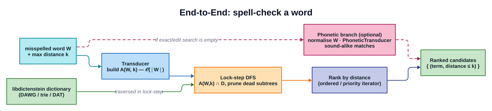

# Getting Started with liblevenshtein-rust

**Version**: 0.9.1
**Last Updated**: 2026-06-19

This guide will help you get started with liblevenshtein-rust for fast approximate string matching.

At a high level, a query builds a Levenshtein automaton `A(W, k)` from your search
term `W` and error bound `k`, then walks it in lock-step with the dictionary to
yield every term within edit distance `k`:



## Installation

### From Cargo

Add to your `Cargo.toml`:

```toml
[dependencies]
liblevenshtein = { git = "https://github.com/universal-automata/liblevenshtein-rust", tag = "v0.9.1" }
```

SIMD (AVX2/SSE4.1) is enabled automatically on x86_64 targets via runtime CPU
feature detection — no feature flag required.

### Installing the CLI Tool

```bash
cargo install --git https://github.com/universal-automata/liblevenshtein-rust --tag v0.9.1 \
  --features cli,compression,protobuf liblevenshtein
```

### Pre-built Packages

Download pre-built packages from the [GitHub Releases](https://github.com/universal-automata/liblevenshtein-rust/releases) page:

- **Debian/Ubuntu**: `.deb` packages
- **Fedora/RHEL/CentOS**: `.rpm` packages
- **Arch Linux**: `.pkg.tar.zst` packages
- **Binaries**: `.tar.gz` and `.zip` archives for Linux and macOS (x86_64 and ARM64)

## Basic Usage

### Simple Fuzzy Matching

```rust
use liblevenshtein::prelude::*;

// Create a dictionary from terms (using DoubleArrayTrie for best performance)
let terms = vec!["test", "testing", "tested", "tester"];
let dict = DoubleArrayTrie::from_terms(terms);

// Create a transducer with Standard algorithm
let transducer = Transducer::new(dict, Algorithm::Standard);

// Query for terms within edit distance 2
for term in transducer.query("tset", 2) {
    println!("Match: {}", term);
}

// Query with distances
for candidate in transducer.query_with_distance("tset", 2) {
    println!("Match: {} (distance: {})", candidate.term, candidate.distance);
}
```

**Output:**
```
Match: test
Match: tester
Match: test (distance: 1)
Match: tester (distance: 2)
```

### Unicode Support

For correct character-level Levenshtein distances with Unicode text, use the character-level dictionary variants:

```rust
use liblevenshtein::prelude::*;

// Create a character-level dictionary for Unicode support
let terms = vec!["café", "naïve", "日本語", "emoji😀"];
let dict = DoubleArrayTrieChar::from_terms(terms);

// Create transducer
let transducer = Transducer::new(dict, Algorithm::Standard);

// Query with Unicode strings
for candidate in transducer.query_with_distance("café", 1) {
    println!("{}: distance {}", candidate.term, candidate.distance);
}
```

**Note**: Character-level dictionaries (`DoubleArrayTrieChar`, `PathMapDictionaryChar`) have ~5% performance overhead and use 4x memory for edge labels compared to byte-level variants, but provide correct Unicode Levenshtein distances.

### Choosing an Algorithm

liblevenshtein supports three Levenshtein distance algorithms:

```rust
use liblevenshtein::prelude::*;

let dict = DoubleArrayTrie::from_terms(vec!["test", "testing"]);

// Standard: insert, delete, substitute
let standard = Transducer::new(dict.clone(), Algorithm::Standard);

// Transposition: adds character transposition (swap adjacent chars)
let transposition = Transducer::new(dict.clone(), Algorithm::Transposition);

// Merge and Split: adds merge and split operations
let merge_split = Transducer::new(dict, Algorithm::MergeAndSplit);
```

**When to use each:**
- **Standard**: General string matching, typos
- **Transposition**: Typos involving swapped characters (e.g., "tset" → "test")
- **MergeAndSplit**: OCR errors, concatenation/separation issues (e.g., "te st" → "test")

### Ordered Results

For applications like code completion, you want results sorted by relevance (distance first, then alphabetically):

```rust
use liblevenshtein::prelude::*;

let dict = DoubleArrayTrie::from_terms(vec![
    "test", "testing", "tested", "tester", "best", "rest"
]);
let transducer = Transducer::new(dict, Algorithm::Standard);

// Get results sorted by distance, then lexicographically
for candidate in transducer.query_with_distance("tset", 2).sorted() {
    println!("{}: {}", candidate.term, candidate.distance);
}
```

**Output:**
```
test: 1
best: 2
rest: 2
tester: 2
tested: 2
testing: 2
```

### Prefix Matching

Enable prefix mode for autocomplete-style matching:

```rust
use liblevenshtein::prelude::*;

let dict = DoubleArrayTrie::from_terms(vec![
    "test", "testing", "tested", "tester", "apple", "banana"
]);
let transducer = Transducer::new(dict, Algorithm::Standard);

// Only match terms starting with "tes"
for candidate in transducer
    .query_with_distance("test", 1)
    .sorted()
    .with_prefix("tes")
{
    println!("{}: {}", candidate.term, candidate.distance);
}
```

**Output:**
```
test: 0
tested: 1
tester: 1
testing: 1
```

## Choosing a Dictionary Backend

liblevenshtein queries any backend from the [`libdictenstein`](../architecture/overview.md)
crate (re-exported here; the `*Char` variants are UTF-8 / `char`-level):

| Backend | Best For | Reads | Updates |
|---------|----------|-------|---------|
| **DoubleArrayTrie(Char)** (default) | static dictionaries, fastest queries (`𝒪(1)` transitions) | wait-free | No |
| **DynamicDawg(Char)** | general dynamic use; SIMD + bloom pruning | `RwLock` | Yes |
| **DynamicDawgU64** | 64-bit labels / hashes | lock-free (`ArcSwap`) | Yes |
| **SuffixAutomaton(Char)** | substring / infix matching | `RwLock` | Yes |
| **Scdawg(Char)** | bidirectional substring (backs WallBreaker) | `RwLock` | Yes |
| **PersistentARTrie(Char)** | huge on-disk dictionaries (mmap, zero-copy) | wait-free | No |
| **PathMapDictionary** | update-heavy workloads (persistent backend) | persistent | Yes |

**Recommendations:**
- **Default choice**: `DoubleArrayTrie` for the fastest queries over a static dictionary.
- **Unicode**: any `*Char` variant for correct `char`-level distances.
- **Need updates**: `DynamicDawg` (or `DynamicDawgU64` for lock-free reads).
- **Substring matching**: `SuffixAutomaton`; bidirectional / large-`k`: `Scdawg`.
- **On-disk / huge**: `PersistentARTrie`.

For a decision tree, see the [backend selection diagram](../diagrams/dictionary-structures/backend-decision-tree.svg) and the [backends guide](backends.md).

## Next Steps

- [Features Guide](features.md) - Comprehensive feature documentation
- [Code Completion Guide](code-completion.md) - Build code completion with liblevenshtein
- [Thread Safety](thread-safety.md) - Concurrent access patterns
- [Algorithm Details](algorithms.md) - Deep dive into Levenshtein algorithms
- [Serialization Guide](serialization.md) - Save and load dictionaries

## Examples

The [Examples & Tutorials index](../examples/README.md) walks through the library
step by step. The runnable programs live in the `examples/` directory:

- `spell_checker.rs` — simple fuzzy matching
- `ordered_query_demo.rs` — sorted results for code completion
- `unicode_diacritics.rs` — Unicode character handling
- `dynamic_dictionary.rs` — runtime dictionary updates
- `fuzzy_maps_code_completion.rs` — value-mapped fuzzy lookup
- `contextual_completion.rs` — scope-aware completion
- `serialization.rs` — save / load dictionaries

Run an example:

```bash
cargo run --example spell_checker
```
